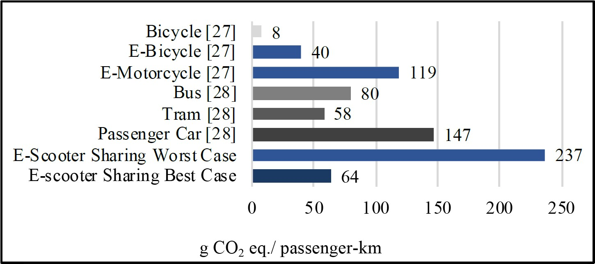
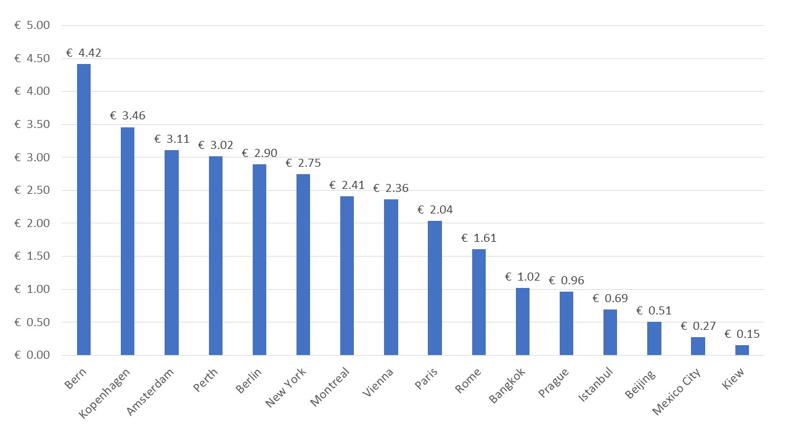
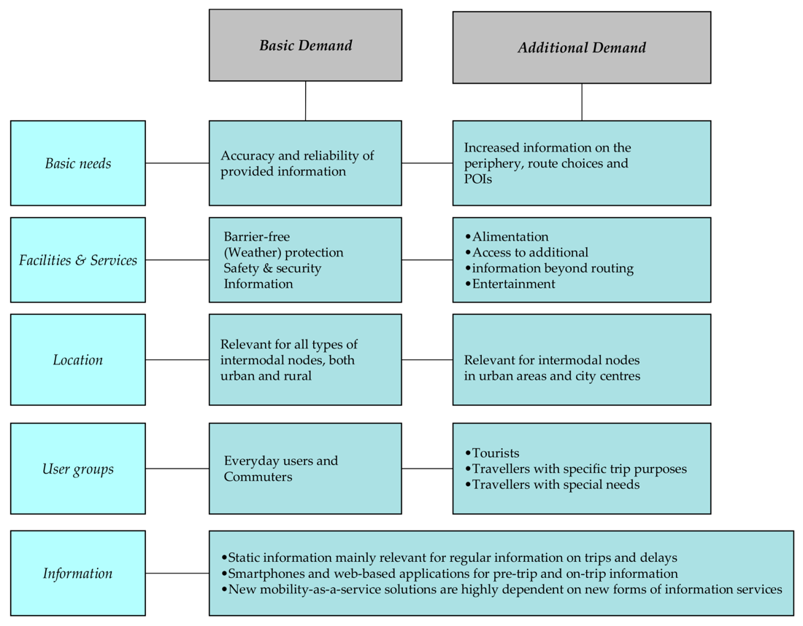

# Multimodales integriertes System {#multimodal}

## Lösungen für die erste und letzte Meile {#flms}

### Synonyme {-}
*first/last/only mile (F/L/O mile), first-last mile (FLM), [FLMS](http://changemobility.at/wiki/index.php?title=First/Last_Mile_Services)*

### Definition {-}
Die in den letzten Jahren ständig steigende Nachfrage nach Güter- und Personenverkehr hat die negativen Auswirkungen der Mobilität (Staus, Verkehrsunfälle, Luftverschmutzung, Lärm und Kosten des Klimawandels) noch verschärft. Städtische Siedlungen sind aufgrund der höheren Bevölkerungsdichte besonders betroffen. Der Begriff "erste-letzte-Meile" (FLM) bezieht sich auf die erste und letzte Etappe jeder Verkehrsbewegung, sowohl im Personen- als auch im Güterverkehr, die die meisten negativen Auswirkungen und die höchsten Kosten verursachen. Aus planerischer Sicht ist es jedoch nicht einfach, die FLM zu identifizieren, da nicht klar ist, wo die FLM physisch beginnt und wo sie endet. Das FLM-Problem hat seinen Ursprung im Bereich der Telekommunikation, die als erste und letzte Stufe zu Verbraucher:innen definiert ist. In den 1970er und 1980er Jahren mussten die Kabelfernsehunternehmen jeden Haushalt einzeln anschließen und verkabeln, als die Technologie in Nordamerika und Europa eingeführt wurde (Nocera et al., 2020).<br/>

In der Verkehrsliteratur gibt es unterschiedliche Definitionen für ein solches Konstrukt. Arvidsson et al. (2016) definieren das FLM im Kontext des Güterverkehrs als den ersten und letzten Teil der Transportkette, in der Güter von einer professionellen Partei zum Standort des Kund:innen transportiert werden, sei es ein Haus, ein Einzelhandelsgeschäft, eine Abladestelle oder eine Fabrik. Im Zusammenhang mit der Personenbeförderung wird er definiert als die erste und letzte Etappe einer Reise mit öffentlichen Verkehrsmitteln und häufig die Reise von Zuhause zu einem Verkehrsknotenpunkt oder umgekehrt.<br/>

Im Zusammenhang mit dem Personenverkehr waren Luftqualität und Verkehrsstaus die Katalysatoren für ein neues Denken in der Stadtgestaltung. Begriffe wie "lebenswert", "Fußgängerzone" und "grüne Straßen" stehen für den Wandel, den viele europäische Städte derzeit durchlaufen. Zu den ergriffenen Maßnahmen gehören Investitionen in die Fahrradinfrastruktur, mehr Fußgängerzonen, neue Grünflächen und Stadtmöbel sowie Beschränkungen für die Nutzung von Privatfahrzeugen. Viele Städte sind dabei, ihre Pläne für nachhaltigere städtische Verkehrssysteme zu formalisieren - wie die Zahl der Städte in ganz Europa zeigt, die einen Plan für nachhaltige urbane Mobilität (SUMP) umsetzen. Die *City Database* | Eltis (2021) enthält inzwischen Angaben zu über 1.000 Städten, die an laufenden oder abgeschlossenen Projekten und Initiativen zur städtischen Mobilität beteiligt sind. Die Mikromobilität hat sich als eine mögliche Lösung für einige der Probleme der Städte herauskristallisiert. Es handelt sich um eine Verkehrsart, die von der jüngeren Generation befürwortet wird, die andere Reisegewohnheiten hat als die älteren Generationen (Twisse, 2020). <br/>

Diese neuen FLM-Lösungen sollen auch dazu beitragen, die Zugänglichkeit zu öffentlichen Verkehrsmitteln zu verbessern. Da der öffentliche Verkehr eine erschwingliche und nachhaltige Mobilitätsoption ist, trägt seine Verbesserung durch ein breites Spektrum an verkehrsmittelgestützten Optionen zur Förderung einer gerechteren Gesellschaft bei. Menschen, denen es an Mobilität mangelt, um Orte wie Arbeit, Bildung und Kinderbetreuung zu erreichen, sind im Verkehr benachteiligt. Der Zugang zu öffentlichen Verkehrsmitteln an beiden Enden einer Transitfahrt wurde als eines der größten Hindernisse für die Verbesserung der Zugänglichkeit zu öffentlichen Verkehrsmitteln ermittelt. Die Minimierung des Defizits auf der ersten und letzten Meile kann Gemeinschaften integrativer machen, indem das Angebot an zugänglichen Optionen erhöht wird (Zuo et al., 2020a). Der Geschwindigkeitsvorteil des Radfahrens gegenüber dem Gehen kann das Problem der ersten und letzten Meile abmildern und bietet eine bessere Punkt-zu-Punkt-Mobilität im Transit (Zuo et al., 2018). Der starke Autoverkehr und die daraus resultierende hohe Verkehrsdichte machen die Straßen jedoch weniger attraktiv und ungeeignet für Radfahrer:innen (Winters et al., 2011) und führen zu fragmentierten Radwegen (Furth et al., 2016). Gleichzeitig macht das schlecht vernetzte Radverkehrsnetz das Radfahren weniger zugänglich und behindert die Zugänglichkeit des Radfahrens als Verkehrsmittel (Zuo et al., 2020a).<br/>

Traditionelle F/L/O-Meilen-Optionen sind Gehen und Radfahren. Mit der Entwicklung neuer Technologien sind jedoch neue F/L/O-Meilen-Optionen für den Individualverkehr verfügbar geworden, die immer bequemer zu nutzen sind. Die neuen Technologien ermöglichen auch eine bessere Integration der verschiedenen Verkehrsmittel und Tarife. Die Verschmelzung verschiedener Verkehrsmittel zu einer Dienstleistung, die den Mobilitätsbedürfnissen der einzelnen Kund:innen entspricht, ist heute ein etabliertes Geschäftsmodell, das als [Mobility-as-a-Service](#maas) bezeichnet wird (EUA, 2019).<br/>

Mikromobilität ist die Bezeichnung für den neuen, exponentiell wachsenden Trend in der städtischen Mobilität zur Verbesserung der F/L/O-Optionen. Der Begriff umfasst alle von Menschen angetriebenen Mikrofahrzeuge wie Fahrräder und Roller, aber auch neue Mikrofahrzeuge wie E-Scooter, E-Bikes und einige andere kleine, elektrisch betriebene Fahrzeuge (Oeschger et al., 2020). Im ITF-Bericht "Safe Micromobility" (OECD/ITF, 2020) wird Mikromobilität definiert als: *"[...] die Verwendung von Mikrofahrzeugen: Fahrzeuge mit einer Masse von höchstens 350 kg und einer bauartbedingten Geschwindigkeit von maximal 45 km/h. Diese Definition begrenzt die kinetische Energie des Fahrzeugs auf 27 kJ, was hundertmal weniger ist als die kinetische Energie, die ein Kleinwagen bei Höchstgeschwindigkeit erreicht".* <br/>

Im ITF-Bericht wird zwischen verschiedenen Alternativen zur Mikromobilität unterschieden (OECD/ITF, 2020):

- Motorisierte Zweiräder
    -Motorrad (motorisiertes Straßenfahrzeug mit zwei bis drei Rädern und einem Sitz, das eine Geschwindigkeit von mehr als 45 km/h erreichen kann)
    -Moped (Motorisiertes Straßenfahrzeug, mit zwei bis drei Rädern und einem Sitz, manchmal mit Pedalen ausgestattet. Die Höchstgeschwindigkeit des Fahrzeugs hängt von den nationalen Vorschriften ab, ist aber in der Regel auf 45 km/h begrenzt).
- Fahrrad
    -Fahrrad (Ein Fahrzeug mit zwei oder mehr Rädern, das im Allgemeinen durch die Muskelkraft der Personen, die es benutzen, über ein Pedalsystem, einen Hebel oder einen Griff angetrieben wird).
    -Fahrrad mit Tretunterstützung oder E-Bike (Pedelec <25 km/h, Speed-Pedelec >25 km/h)
- Mobilitätsroller (speziell für Menschen mit eingeschränkter Mobilität, meist ältere oder behinderte Menschen)
- Scooter
    -Stehroller, Kick-Scooter oder Push-Scooter (Ein Fahrzeug mit Lenkstange, Plattform und Rädern, das durch Abstoßen vom Boden angetrieben wird. Es gibt Modelle mit zwei, drei oder vier Rädern. Stehroller unterscheiden sich von Skateboards durch das Vorhandensein einer zentralen Lenksäule und einer Lenkstange).
    -E-Scooter und Steh- oder Sitzroller (Ein Steh- oder Sitzroller, der durch den Elektromotor selbst angetrieben werden kann).
- Skateboard
    -Skateboard (Brett mit vier Rädern auf zwei Achsen, das von Benutzer:innen durch Treten gegen den Boden angetrieben wird).
    -Elektro-Skateboard (Skateboard mit elektrischer Batterie, Motor und kabelloser Fernsteuerung).
- Selbstbalancierend
    -Hoverboard (Selbstbalancierendes Mikrofahrzeug, das aus zwei motorisierten Rädern besteht, die mit einem Paar gelenkiger Pads verbunden sind, auf welchen die Fahrer:innen stehen. Die Fahrer:innen steuern die Geschwindigkeit, indem sie sich nach vorne oder hinten lehnen, und die Fahrtrichtung, indem er die Pads verdreht).
    -Onewheel (Selbstbalancierendes Elektrorad mit einer Plattform, auf der die Benutzer:innen stehen. Die Füße stehen in einem 90°-Winkel zur Fahrtrichtung.)
    -Elektro-Einrad (Selbstbalancierendes, einachsiges, persönliches Transportgerät, das mit den Füßen in Fahrtrichtung mit einem Rad oder mit zwei Rädern betrieben wird. Fahrer:innen steuern die Geschwindigkeit, indem sie sich nach vorne oder hinten lehnen, und lenken, indem sie das Gerät mit den Füßen drehen).
    -Elektrische Schlittschuhe (Schlittschuhe mit elektrischer Batterie und Motor, die von Benutzer:innen durch Vorwärts- oder Rückwärtslehnen oder mit Hilfe einer Fernsteuerung gesteuert werden).
    -Schlittschuhe (Ein Paar Schuhe mit einem Satz Räder an der Unterseite.)

```{r, echo=FALSE, out.width="50%", fig.cap="Mikromobilitaet (angepasst von OECD/ITF (2020))."}
knitr::include_graphics("image/micromobility.jpg")
```

Definitionen, Klassifizierungen und rechtliche Rahmenbedingungen für Mikromobilität sind weltweit unterschiedlich. Fahrräder sind in den meisten Ländern das kleinste Fahrzeug. Folglich sind eine Reihe von Kleinstfahrzeugen - wie E-Scooter, E-Skateboards und selbstbalancierende Fahrzeuge - von den Klassifizierungen ausgeschlossen. In einigen Fällen werden sie als Spielzeug eingestuft und sind daher nicht für den öffentlichen Straßenverkehr zugelassen. Als Übergangslösung hat Korea diese Geräte als Autos eingestuft. Die Behörden in Singapur haben beschlossen, eine neue Fahrzeugkategorie mit der Bezeichnung "Personal Mobility Device" (PMD) zu schaffen. Angesichts der offensichtlichen internationalen Bedeutung von Kleinstfahrzeugen und der Schwierigkeit, sie zu definieren und zu kategorisieren, könnte es sinnvoll sein, ein international anerkanntes Klassifizierungssystem für sie zu entwickeln (OECD/ITF, 2020).<br/>

In der [Verordnung Nr. 168/2013 der Europäischen Union](https://unece.org/resolutions), werden Fahrzeuge der Mikromobilität der Klasse L zugeordnet (UNECE, 2017). Fahrzeuge der Klasse L sind motorisierte zwei-, drei- und vierrädrige Fahrzeuge. Die Kategorie verwendet Leistung, Energiequelle, Geschwindigkeit, Länge, Breite und Höhe als Klassifizierungskriterien. Allerdings können nur "Elektrofahrräder mit einer Höchstgeschwindigkeit von 25 km/h und einer Nutzleistung zwischen 250 Watt und 1 000 Watt" und "alle zweirädrigen Fahrzeuge mit einer bauartbedingten Höchstgeschwindigkeit von mehr als 25 km/h und bis zu 45 km/h und einer Nutzleistung von bis zu 4 000 Watt" in die Klasse L1e der "leichten zweirädrigen Kraftfahrzeuge" eingestuft werden. Andere Kleinstfahrzeuge lassen sich in keine Kategorie einordnen. OECD/ITF (2020) schlägt vor, die Mikromobilität wie folgt zu klassifizieren:

```{r, echo=FALSE, out.width="50%", fig.cap="Vorgeschlagene Klassifizierung von Geraeten der Mikromobilitaet (OECD/ITF (2020)."}
knitr::include_graphics("image/micromobility_classes.jpg")
```

Im Güterverkehr ist der [intermodale Güterverkehr](#intermodal_freight) als Zubringer zu den Städten von entscheidender Bedeutung für die Reduzierung der Emissionen. Im Stadtzentrum (siehe [Stadtlieferungen](#urban_delivery)) gibt es zwei Hauptbereiche, die praktische und relevante Lösungen für die Herausforderungen und die Effizienz des Güterverkehrs auf der letzten Meile bieten könnten: (1) Maßnahmen zur Steuerung der Frachtnachfrage (FDM) und (2) Verbesserung der Park- und Ladeinfrastruktur. Eine Maßnahme zur Nachfragesteuerung wäre die Förderung von Lieferungen außerhalb der Geschäftszeiten, um die Liefertätigkeit von Spediteuren und Verladern zu ändern. Außerdem könnten Empfängerpreise und Anreize eine wichtige Rolle bei der Reduzierung des Güterverkehrs spielen. (Holguín-Veras & Sánchez-Díaz, 2016). In europäischen Städten (insbesondere in Frankreich) wird ein erheblicher Anteil an doppelt geparkten Lieferfahrzeugen (Lieferfahrzeuge, die auf der Straße parallel zu geparkten Autos abgestellt sind) beobachtet (Patier et al., 2014). In diesem Zusammenhang könnte die [intelligente Buchung von Lieferflächen ](#space_book) die Auswirkungen verringern. [Passagierdrohnen ](#passenger_drones) und [Lieferflotten mit Elektrofahrzeugen ](#electric_delivery_fleets) könnten ebenfalls einige der externen Effekte des Güterverkehrs in Städten reduzieren, aber sie könnten auch einige neue negative externe Effekte schaffen. 

### Wichtige Interessensgruppen {-}
- **Betroffene**: Alle Bürger:innen
- **Verantwortliche**: Verkehrsdienstleister und Betreiber öffentlicher Verkehrsmittel, MaaS-Betreiber und -Integratoren, Stadtverwaltungen, lokale, regionale und nationale Behörden 

### Aktueller Stand der Wissenschaft und Forschung {-}
Die EUA (2019) kommt zu dem Schluss, dass eine bessere F/L/O-Meilen-Anbindung in Städten die Umwelt- und Gesundheitsergebnisse erheblich verbessern kann. Die Ausschöpfung dieses Potenzials erfordert jedoch ein tiefes Verständnis der verschiedenen Optionen, ihrer Stärken und Schwächen und ihrer Auswirkungen auf das Mobilitätssystem als Ganzes. Dies ist nicht immer einfach, da die Umwelt- und Gesundheitsauswirkungen von F/L/O-Mobilitätsoptionen davon abhängen, wie sie genutzt werden und was sie ersetzen. Dies unterstreicht die Tatsache, dass die zunehmende Verfügbarkeit von E-Scootern und digitalen Mitfahrplattformen das Mobilitätsverhalten in den Städten verändert, aber nicht immer die klimafreundlichere Wahl begünstigt. Ein einfaches Beispiel wäre eine kurze Fahrt mit einem E-Scooter. Wenn diese Fahrt eine Motorrad- oder Autofahrt ersetzt, sind die Auswirkungen auf Umwelt und Gesundheit positiv. Ersetzt sie eine Fahrt zu Fuß oder mit dem Fahrrad, verschlechtert sich die Situation. Mehr Transportmöglichkeiten können auch dazu führen, dass Menschen zusätzliche oder längere Fahrten unternehmen, was wiederum die Situation verschlechtern könnte. Darüber hinaus wird der öffentliche Verkehr ein wesentlicher Bestandteil jedes nachhaltigen städtischen Verkehrssystems bleiben. Gute F/L/O-Meilen-Optionen können den öffentlichen Verkehr attraktiver machen und seine Nutzung erhöhen, ihn aber nicht vollständig ersetzen (EUA, 2019). Laa & Leth (2020) stellen außerdem fest, dass E-Scooter-Fahrten meist Fahrten ersetzen, die ansonsten mit einem nachhaltigeren Verkehrsmittel unternommen worden wären. <br/>

Im Hinblick auf die ökologische Nachhaltigkeit vergleichen Severengiz et al. (2020) die „g CO~2~ eq“/Personenkilometer (pkm) verschiedener Verkehrsträger (Abbildung 7.3). Moreau et al. (2020) verglichen gemeinsam genutzte (shared) und private E-Scooter und berechneten 131g CO~2~ eq/pkm für das geteilte Fahrzeug und 67g CO~2~ eq/pkm für das private Fahrzeug.

```{r, echo=FALSE, out.width="50%", fig.cap="Vergleich der CO~2~-Aequivalent-Emissionen pro Personenkilometer der verschiedenen Verkehrstraeger (Severengiz et al., 2020)"}

```

Erreichbarkeit ist ein Indikator für die Fähigkeit, häufig besuchte Orte effizient zu erreichen. Sie gewinnt zunehmend an Bedeutung als Ergänzung zu den traditionelleren mobilitätsbasierten Leistungskennzahlen in der Verkehrsplanung, wie z. B. durchschnittliche Verspätungen" und Dienstleistungsniveau". Die Bewertung der Leistung unter dem Aspekt der Erreichbarkeit bietet einen ausgewogenen, ganzheitlicheren Ansatz für die Verkehrsanalyse und -planung. Insbesondere werden alternative Strategien zur Verringerung von Staus und zur Milderung von Umweltproblemen in Betracht gezogen, wie z. B. die Förderung einer effizienten, ressourcenschonenden Flächennutzungspolitik. Erreichbarkeit ist ein Produkt aus Mobilität und Nähe, das entweder durch eine schnellere Verbindung zwischen Punkt A und Punkt B (Mobilität) oder durch eine größere Nähe zwischen den Punkten A und B (Nähe) oder durch eine Kombination dieser Faktoren verbessert wird. In diesem Sinne verleiht ein auf Erreichbarkeit basierender Ansatz Initiativen zur Flächennutzung und Instrumenten des Stadtmanagements Legitimität (Cervero, 2005).
Die Erreichbarkeit wird in der Literatur jedoch unterschiedlich definiert. Shin et al. (2007) maßen die Erreichbarkeit anhand von Näherungsindizes (Entfernung und Gehzeit zur nächstgelegenen U-Bahn-Station). Martínez & Viegas (2009) definierten die Erreichbarkeit anhand der Nähe zu öffentlichen Verkehrsknotenpunkten und dem Straßennetz. Bei gravitätsähnlichen Maßen wird die Erreichbarkeit einer Zone durch die Ziele bestimmt, die von dieser Zone aus erreicht werden können, negativ gewichtet durch die Reisezeit, Entfernung oder Kosten zwischen diesen beiden Zonen (Grengs et al., 2010). Beim isochronen Ansatz wird die Erreichbarkeit als die Anzahl der Ziele gemessen, die innerhalb einer bestimmten Reisezeit erreicht werden können (Cervero, 2005). Fan et al. (2012) untersuchten die Auswirkungen der Einführung von Stadtbahnen auf die Verkehrsgerechtigkeit anhand der kumulierten 30-Minuten-Erreichbarkeit von Arbeitsplätzen mit öffentlichen Verkehrsmitteln. Die erste und letzte Meile ist eine wichtige Komponente einer Transitfahrt und bestimmt, ob der Transitdienst zugänglich ist oder nicht. Radfahren (oder andere FLM-Optionen) verringern die Ungleichheit im Verkehr, indem sie den Einzugsbereich des öffentlichen Verkehrs vergrößern, so dass die Menschen mehr Arbeitsplätze mit öffentlichen Verkehrsmitteln erreichen können (Zuo et al., 2020). <br/> 

Die EEA (2019) fasst die Erkenntnisse für einen systemischen Wandel durch die Nutzung von First/Last/Only-Mobilitätsoptionen als Vorschläge für Regierungen wie folgt zusammen:
- Verdeutlichung der Auswirkungen von Mobilitätsentscheidungen und Angebot von Alternativen 
    - Konfrontation der Verkehrsteilnehmer:innen mit den Kosten ihrer Mobilitätsentscheidungen (Internalisierung der externen Kosten jedes Verkehrsmittels)
    - Ausreichende und bequeme Alternativen anbieten
- Förderung des aktiven Verkehrs für die F/L/O - Mile
- Technologie mit den Zielen der nachhaltigen Mobilität in Einklang bringen

Bruzzone et al. (2021) und Nocera et al. (2020) untersuchen die Kombination von Personen- und Güterverkehrsströmen mit Schwerpunkt auf der letzten Meile. Bei einem solchen Modell handelt es sich um ein integriertes System, bei dem sich Fahrgäste und Güter Fahrzeuge, Infrastruktur, städtischen Raum oder mehr als eines dieser Elemente gleichzeitig teilen. Fatnassi et al. (2015) zeigen beispielsweise die potenziellen Nachhaltigkeitsgewinne, die sich aus der gemeinsamen Nutzung von Gütern und Fahrgästen in einem Netz ergeben, wobei der Schwerpunkt auf der Verbesserung der Servicezeiten und der Energieverschwendung liegt.<br/>

In Bezug auf die Sicherheit stellen [OECD/ITF](https://www.itf-oecd.org/safe-micromobility) 2020 fest, dass eine Fahrt mit dem Auto oder Motorrad in einem dichten städtischen Gebiet viel wahrscheinlicher zu tödlichen Unfällen von Verkehrsteilnehmer:innen führt als eine Fahrt mit einem Kleinstfahrzeug vom Typ A. Eine Verlagerung des Verkehrs von Kraftfahrzeugen auf Kleinstfahrzeuge des Typs A kann daher eine Stadt sicherer machen. Eine Verlagerung von Fußgänger:innen auf Kleinstfahrzeuge des Typs A hätte den gegenteiligen Effekt. Die Sicherheit von E-Scootern wird sich in den nächsten Jahren wahrscheinlich verbessern, wenn Nutzer:innen lernen, sich im Stadtverkehr zurechtzufinden, und sich Autofahrer:innen und Fußgänger:innen an die neuen Mobilitätsformen gewöhnen. Die Sicherheit wird sich auch verbessern, wenn die Regierungen eine sichere Fahrradinfrastruktur und gezielte Sicherheitsvorschriften für Kleinstfahrzeuge und Shared-Mobility-Dienste einführen. Aufgrund des rasanten Innovationstempos bei der Entwicklung von Kleinstfahrzeugen gibt es erhebliche regulatorische Herausforderungen. Sie schlagen folgende Maßnahmen vor, um die Sicherheit der Mikromobilität zu verbessern:

- Bereitstellung von geschütztem Raum für Mikromobilität und Sicherheit für Fußgänger:innen (Wenn sich Fußgänger:innen auf Gehwegen nicht sicher fühlen, wird die Zahl der Fußgänger:innen zurückgehen).
- Niedrige Geschwindigkeiten von E-Scootern und E-Bikes sollten wie Fahrräder geregelt werden, höhere Geschwindigkeiten von Mikromobilen wie Mopeds
- Sammlung von Daten über Fahrten mit Kleinstfahrzeugen und Unfälle (um die Sicherheit der Straßennetze proaktiv zu verwalten)
- Einbindung der Mikromobilität in die Verkehrserziehung
- Bekämpfung von Trunkenheit am Steuer und Geschwindigkeitsüberschreitungen bei allen Fahrzeugtypen
- Beseitigung der Anreize für Fahrer:innen mikromobiler Fahrzeuge, zu schnell zu fahren (die minutengenaue Anmietung kann ein Anreiz sein, zu schnell zu fahren oder Verkehrsregeln zu ignorieren. Zu den Alternativen gehören eine feste Fahrgebühr, eine entfernungsabhängige Gebühr oder ein Mitgliedsbeitrag).
- Verbesserung des Designs von Kleinstfahrzeugen (Hersteller von Kleinstfahrzeugen sollten versuchen, die Stabilität und Straßenhaftung zu verbessern. Lösungen könnten in Luftreifen, größeren Rädern und der Rahmengeometrie gefunden werden, aber auch in Bereichen, die noch erforscht werden müssen).
- Verringerung der allgemeinen Risiken im Zusammenhang mit der gemeinsamen Nutzung von Mikromobilität (Minimierung der Fahrzeugkilometer, die von Begleitfahrzeugen für die Beförderung oder das Aufladen von Mikromobilitätsgeräten zurückgelegt werden, Verwendung von herausnehmbaren Batterien oder Batterien mit höherer Kapazität und Steckdosen, Bereitstellung von Flächen für das Parken von Mikrofahrzeugen auf der Straße).


### Aktueller Stand der praktischen Umsetzung {-}

Eine neue Koalition, Micromobility for Europe (MMfE), hat sich 2021 in Europa zusammengeschlossen. Acht E-Scooter-Betreiber (Bird, Bolt, Dott, FreeNow, Lime, TIER, Voi und Wind) wollen durch diese Koalition zur Entwicklung eines kohärenten politischen Rahmens in Europa beitragen (Intelligent Transport, 2021).<br/>

Research and Markets (2021) nennt Bike-Sharing, Kick-Scooter-Sharing und Scooter-Sharing als die dominierenden Sharing-Modi für Mikromobilität. Bis 2020 wird der weltweite Fuhrpark auf rund 20,5 Millionen Fahrzeuge geschätzt. Der Anteil des Bike-Sharings an der weltweiten Flottengröße des Mikromobilitätsmarktes wird derzeit auf fast 98 % geschätzt. Als wichtigster Faktor wird die Weiterentwicklung der Technologien genannt. Als Innovationen werden Infrastrukturlösungen (z. B. intelligente Andockstationen, solarbetriebene Ladestationen und Mobilitätshubs), Hardwarelösungen (z. B. intelligente Schlösser und Sensoren) und High-End-Softwarelösungen (z. B. Kartierung und Navigation, Flottensicherheit, Echtzeit-Flottendaten und -Analysen sowie intelligentes Flottenmanagement) genannt, die von KI-Maschinen und IoT-Sensoren angetrieben werden. Es wird auch erwähnt, dass sich die Geschäftsmodelle der Mikromobilität weiterentwickeln. So gibt es beispielsweise bereits öffentlich-private Partnerschaften, private Bike-Sharing-Systeme und gemeinnützige Programme. Es wird erwartet, dass Mikromobilitätssysteme weiterhin in den kommunalen Verkehr eingebettet werden und ein integraler Bestandteil des entstehenden Mobility-as-a-Service-Ökosystems (MaaS) werden.<br/> 

Im Jahr 2018, dem ersten vollen Jahr nach der Einführung des E-Scooter-Sharings, haben die Amerikaner bereits 38,5 Millionen Fahrten mit gemeinsam genutzten E-Scootern unternommen (im Vergleich zum stationsbasierten Bike-Sharing mit 36,5 Millionen Fahrten, das seit fast zehn Jahren auf dem Markt ist). Die bestehende Nachfrage nach anderer Mikromobilität ist jedoch nicht zurückgegangen. Das zeigt, dass es sinnvoll ist, verschiedene Modelle/Fahrzeuge zu unterstützen. In Anbetracht der hohen Nachfrage und der raschen Akzeptanz von Mikromobilitätsoptionen liegt das erwartete weltweite Marktpotenzial bis 2030 bei über 500 Milliarden Dollar (Eliasen, 2021). Im Vergleich dazu wird der Mikromobilitätsmarkt in Europa auf über 100 Milliarden Euro im Jahr 2030 geschätzt (Twisse, 2020). Die meisten Neugründungen von Mikromobilitätsplattformen (hauptsächlich E-Scooter) waren jedoch anfangs unrentabel, da die Betriebskosten für den Betrieb von E-Scootern (Aufladen, Reparatur/Wartung, Versicherungs- und Zahlungsgebühren) so hoch waren, dass die Amortisationszeit für den anfänglichen Rollerkauf kürzer war als die Lebensdauer des Rollers, was zu einer negativen Investitionsrendite pro Roller führte. Laut Travis VanderZanden, CEO von Bird, hat sich die Rentabilität der Einheiten in den letzten Jahren aufgrund der verbesserten Haltbarkeit der Roller und der Preiserhöhungen für die Kund:innen deutlich verbessert (Eliasen, 2021).<br/>

Haas (2018) nennt vier Herausforderungen, die es für die Attraktivität der FLM zu bewältigen gilt:<br/>

**Herausforderung 1: Erreichbarkeit** <br/>
Es kommt häufig vor, dass in der Nähe kein Sharing-Transport angeboten werden kann. *"Im Durchschnitt sind unsere Kund:innen bereit, 300 Meter zu Fuß zu einem Auto zu gehen"*, sagt Olivier Reppert (Chef des Carsharing-Marktführers Car2go). *"Wenn das mehrmals nicht klappt, springen sie ab."* Das Unternehmen arbeitet deshalb intensiv daran, die Fahrzeuge so nah wie möglich an die Kund:innen zu bringen. *"Wir wissen sehr genau, wo welches Auto zu welcher Zeit stehen sollte"*, sagt Reppert. Das lässt sich durch anonyme Datenerfassung genau bestimmen. Aber: *"Heute sind wir noch nicht in der Lage, immer genau diese Punkte anzusteuern." * Große Hoffnungen setzt Reppert auf den künftigen Einsatz von automatisierten Fahrzeugen, die sich selbst zu Carsharing-Hotspots bewegen: *"Dann bräuchten wir nur noch 50 Prozent der heutigen Flotte, um die gleiche Nachfrage zu bedienen"*, sagt er..<br/>

**Herausforderung zwei: Die Kombination**<br/>
Um die perfekte Kombination der verschiedenen Angebote zu ermöglichen, wird eine App benötigt, die alle Optionen umfasst und aufeinander abstimmt. Bislang gibt es nur wenige solcher Apps mit möglichst vielen Verkehrsmitteln in den Städten. Das könnte sich verbessern, wenn die Städte, die den besten Überblick über die verfügbaren Verkehrsmittel in ihrem Gebiet haben sollten, selbst die Führung übernehmen.<br/>

**Herausforderung drei: Die rechtliche Situation**<br/>
*"Wenn sich verschiedene Kleinfahrzeuge einfach die Geh- und Radwege oder die Straßen teilen, führt das zu mehr Unfällen"*, sagt Markus Friedrich (Professor für Verkehrsplanung und Verkehrsleittechnik an der Universität Stuttgart). Der Platz reicht aber nicht aus, um für jeden Typ eine eigene Spur anzubieten. Die Lösung sieht er daher in einer Änderung der aktuellen Geschwindigkeitsbegrenzung in der Straßenverkehrsordnung: *"Mit einer Regelgeschwindigkeit von 30 km/h können sich die Fahrzeuge den Straßenraum besser teilen"*, sagt der Professor. *"Und sobald viele Fahrzeuge über Elektroantriebe verfügen, ist in den heutigen Tempo-30-Zonen ein Limit von 20km/h denkbar. *" Auf innerstädtischen Hauptverkehrsstraßen könnten noch höhere Geschwindigkeiten erlaubt sein.<br/>

**Herausforderung vier: Der Ausbau des öffentlichen Verkehrs**<br/>
Die zahlreichen zusätzlichen Dienste könnten Bus und Bahn nicht nur ergänzen, sondern ersetzen. Die Nachfrage könnte erheblich steigen, wenn sich die Vorteile der gewonnenen Effizienz entfalten - von höherer Verfügbarkeit bis zu günstigeren Preisen. Deshalb muss der öffentliche Verkehr schneller werden, damit er einen Fahrzeitvorteil bietet. Nötig sind laut Friedrich Schnellbusse und Schnellzüge, die eigene Routen bekommen und nicht mehr so oft halten wie bisher. Viele Städte bräuchten eine wesentlich dichtere Taktung oder zusätzliche Expresszüge.<br/><br/>

### Relevante Initiativen in Österreich {-}

**Passenger FLM**

- E-scooters
    - [Autorevue.at](https://autorevue.at/ratgeber/e-scooter-wien-vergleich)
    - [Stadt-wien.at](https://www.stadt-wien.at/wien/news/e-scooter-sharing-system-in-wien.html)
    - [Wien.gv.at](https://www.wien.gv.at/verkehr/scooter-roller/index.html)
    - [Öamtc.at](https://www.oeamtc.at/thema/fahrrad/e-kleintretroller-e-scooter-in-oesterreich-31721872)
    - [Österreich.gv.at](https://www.oesterreich.gv.at/themen/freizeit_und_strassenverkehr/Elektro-Scooter,-Quads-und-Co/Seite.610110.html)


- Bicycle and E-Bicycle hire
    - [Firmenradl.at](https://firmenradl.at/cms/)
    - [Citybikewien](https://www.citybikewien.at/de)
    - [Citybikesalzburg](http://www.citybikesalzburg.at/)
    - [Nextbike](https://www.nextbike.at/de/niederoesterreich/)
    - [Tpis.at](https://www.tips.at/nachrichten/linz/land-leute/523512-linzer-radverleih-startet-im-fruehjahr-an-40-standorten)


- Car sharing
    - [VCÖ](https://www.vcoe.at/presse/presseaussendungen/detail/carsharing-haushalte-potential-2018)
    - [ÖBB](https://www.carsharing-wien.com/anbieter/oebb-rail-and-drive)


- Ride-hailing & Ride-sharing
    - [Ots.at](https://www.ots.at/presseaussendung/OTS_20210113_OTS0026/free-now-will-als-erste-mobilitaetsplattform-in-europa-bis-2030-null-emissionen-erreichen)
    - [Umweltberatung.at](https://www.umweltberatung.at/carsharing-mitfahrboersen)
    - [Greendrive.at](https://greendrive.at/premium/#benefits)
    - [Carployee.com](https://www.carployee.com/#start-section)
    - [Ummadum.com](https://ummadum.com/)


- Mobility-as-a-Service
    - [AustriaTech.at](https://www.austriatech.at/assets/Uploads/Publikationen/PDF-Dateien/29fc02ada2/MaaS-miA_english_102019_web.pdf)
    - [maas-ready.at](https://maas-ready.at) 
    - [ultimob.at](https://www.ultimob.at) 
    - [tim-oesterreich.at](https://www.tim-oesterreich.at/graz/) 
    - [wegfinder.at](https://wegfinder.at/) 
    - [wienerlinien.at](https://www.wienerlinien.at/eportal3/ep/channelView.do/pageTypeId/66526/channelId/-3600060) 
    - [anachb.vor.at](https://anachb.vor.at/) 

- Passenger drones
    - [Derbrutkasten.com](https://brutkasten.com/autonome-lufttaxis-linz-ag-facc-ehang/)
    - [Derstandard.at-1](https://www.derstandard.at/consent/tcf/story/2000103120464/erste-teststrecke-fuer-e-lufttaxis-2020-in-linz)
    - [Derstandard.at-2](https://www.derstandard.at/consent/tcf/story/2000122402408/flugtaxis-wann-kommt-der-tesla-der-luefte)


- Demand responsive transit
    - [Bedarfsverkehr.at](https://www.bedarfsverkehr.at/content/Literatur)
    - [Repositum.tuwien.at](https://repositum.tuwien.at/handle/20.500.12708/1312)
    - [Projekte.ffg.at](https://projekte.ffg.at/projekt/2929323)


- Mobility hubs
    - [Wienmobil-stationen](https://www.wienerlinien.at/web/wiener-linien/wienmobil-stationen)
    - [Tim-oesterreich](https://www.tim-oesterreich.at/)
    - [Wien.gv.at](https://www.wien.gv.at/stadtentwicklung/studien/pdf/b008521.pdf)


**Freight FLM**

- Urban Deliveries
    - [Logistik2030.at-1](https://www.logistik2030.at/?page_id=268)
    - [Infothek.bmk.gv.at](https://infothek.bmk.gv.at/gruene-stadtlogistik-post-testet-city-hubs-in-wien/)
    - [Logistik2030.at-2](https://www.logistik2030.at/?page_id=63)
    - [Remihub.at](https://www.remihub.at/)
    - [Logpoint.at](https://logpoint.at/ueber-uns/gruene-logistikwelt-und-standorte/)
    - [Wu.ac.at](https://www.wu.ac.at/scm/projekte/)
    - [Post.at](https://www.post.at/p/c/vorzimmer-zustellung)


- Smart delivery space booking
    - [Ots.at](https://www.ots.at/presseaussendung/OTS_20150123_OTS0044/simple-stressfreie-ladezonensuche-wk-wien-praesentiert-neue-app)
    - [WKO1](https://www.wko.at/service/verkehr-betriebsstandort/Ladezonen-Nutzung.html)
    - [WKO2](https://www.wko.at/service/w/verkehr-betriebsstandort/ladezone-wien-app.html)
    - [FFG](https://www2.ffg.at/verkehr/projekte.php?id=805&lang=de&browse=programm)

- Delivery drones
    - [Öamtc.at](https://www.oeamtc.at/thema/drohnen/drohnen-info-app-26853120)

- Freight hubs
    - [Infrastruktur.oebb.at](https://infrastruktur.oebb.at/en/partners/terminals/locations/terminal-wien-sued)
    - [DHL-freight-connections.com](https://dhl-freight-connections.com/de/unternehmen/dhl-eroffnet-hochmodernes-logistikdrehkreuz-am-flughafen-wien/)
    - [Logistik2030.at](https://www.logistik2030.at/?page_id=63)
    - [Thinkportvienna.at](https://www.thinkportvienna.at/ueber-uns/projekte/)
    - [Hafen-wien.com](https://www.hafen-wien.com/de/home)

### Auswirkungen in Bezug auf die Ziele für nachhaltige Entwicklung (SDGs) {-}

```{r , echo=FALSE, results='asis'}
cat('| Ebene der Auswirkungen| Indikator|Richtung der Auswirkungen| Beschreibung des Ziels & SDG|Beschreibung des Ziels & SDG|
|:------------:|:-----------:|:------------:|:------------:|:------------:|
|Systemisch|Verringerung der Ungleichheit bei den Verkehrsdiensten|          **+**|Gleichheit (*5,10*)|Zuo et al., 2020a|
|Systemisch|Verringerung negativer externer Effekte, aber Substitution durch umweltfreundlichere Verkehrstraeger, z. B. zu Fuss|         **~**|Oekologische Nachhaltigkeit (*7,12,13,15*)|Twisse, 2020|
|Systemisch|Gewinne aus dem Wachstum des Mikromobilitaetssektors (F/L/O-Optionen)|          **+**|Nachhaltige wirtschaftliche Entwicklung (*8,11*)|Goessling, 2020|
|Systemisch|Verbesserung der Technologie von Mikromobilitaetsgeraeten|**+**|Innovation und Infrastruktur (*9*)|Eliasen, 2021|
')
```

### Technologie- und gesellschaftlicher Bereitschaftsgrad {-}

```{r , echo=FALSE, results='asis'}
cat('|Stand der Technologiebereitschaft| Gesellschaftlicher Bereitschaftsgrad|
|:----:|:----:|
|7-9|6-7|')
```

### Weitere links {-}

- [UNECE.org](https://unece.org/resolutions)
- [ELTIS.org](https://www.eltis.org/resources/case-studies/rise-micromobility)


### Referenzen {-}

- Arvidsson, N., Givoni, M., & Woxenius, J. (2016). Exploring last mile synergies in passenger and freight transport. Built Environment, 42(4), 523–538. https://doi.org/10.2148/benv.42.4.523
- Bruzzone, F., Cavallaro, F., & Nocera, S. (2021). The integration of passenger and freight transport for first-last mile operations. Transport Policy, 100, 31-48. https://doi.org/10.1016/j.tranpol.2020.10.009
- Cervero, R. (2005). Accessible Cities and Regions: A Framework for Sustainable Transport and Urbanism in the 21st Century. https://doi.org/10.11436/mssj.15.250
- City database | Eltis. (2021, July 19). https://www.eltis.org/mobility-plans/city-database
- EEA, E. E. A. (2019). The first and last mile - the key to sustainable urban transport (Issue 18).
- Eliasen, J. (2021, January 15). The Future of Micromobility. How VCs and E-Scooters kicked off the… | by Jason Eliasen | The Startup | Medium. https://medium.com/swlh/the-future-of-micromobility-2d4d96d4e2dd
- Fan, Y., Guthrie, A., & Levinson, D. (2012). Impact of light-rail implementation on labor market accessibility. Journal of Transport and Land Use, 5(3), 28-39.
- Fatnassi, E., Chaouachi, J., & Klibi, W. (2015). Planning and operating a shared goods and passengers on-demand rapid transit system for sustainable city-logistics. Transportation Research Part B: Methodological, 81, 440-460. https://doi.org/10.1016/j.trb.2015.07.016
- Furth, P. G., Mekuria, M. C., & Nixon, H. (2016). Network Connectivity for Low-Stress Bicycling. Transportation Research Record, 2587(1), 41-49. https://doi.org/10.3141/2587-06
- Gössling, S. (2020). Integrating e-scooters in urban transportation: Problems, policies, and the prospect of system change. Transportation Research Part D: Transport and Environment, 79(January), 102230. https://doi.org/10.1016/j.trd.2020.102230
- Grengs, J., Levine, J., Shen, Q., & Shen, Q. (2010). Intermetropolitan Comparison of Transportation Accessibility: Sorting Out Mobility and Proximity in San Francisco and Washington, D.C. Journal of Planning Education and Research, 29(4), 427-443. https://doi.org/10.1177/0739456X10363278
- Haas, C. (2018, November 13). Nahverkehr: So lässt sich die letzte Meile nach Hause bequem zurücklegen - WELT. https://www.welt.de/wirtschaft/article183688842/Nahverkehr-So-laesst-sich-die-letzte-Meile-nach-Hause-bequem-zuruecklegen.html
- Holguín-Veras, J., & Sánchez-Díaz, I. (2016). Freight Demand Management and the Potential of Receiver-Led Consolidation programs. Transportation Research Part A: Policy and Practice, 84, 109-130. https://doi.org/10.1016/j.tra.2015.06.013
- Intelligent Transport. (2021, February 2). Big names across micromobility sector form European coalition. https://www.intelligenttransport.com/transport-news/116405/micromobility-for-europe/
- Laa, B., & Leth, U. (2020). Survey of E-scooter users in Vienna: Who they are and how they ride. Journal of Transport Geography, 89(October), 102874. https://doi.org/10.1016/j.jtrangeo.2020.102874
- Martínez, L. M., & Viegas, J. M. (2009). Effects of Transportation Accessibility on Residential Property Values: Hedonic Price Model in the Lisbon, Portugal, Metropolitan Area. Transportation Research Record, 2115(1), 127-137. https://doi.org/10.3141/2115-16
- Moreau, H., de Meux, L. J., Zeller, V., D’Ans, P., Ruwet, C., & Achten, W. M. J. (2020). Dockless e-scooter: A green solution for mobility? Comparative case study between dockless e-scooters, displaced transport, and personal e-scooters. Sustainability (Switzerland), 12(5). https://doi.org/10.3390/su12051803
- Nocera, S., Pungillo, G., & Bruzzone, F. (2020). How to evaluate and plan the freight-passengers first-last mile. Transport Policy. https://doi.org/10.1016/j.tranpol.2020.01.007
- OECD/ITF. (2020). Safe Micromobility. 98.
- Oeschger, G., Carroll, P., & Caulfield, B. (2020). Micromobility and public transport integration: The current state of knowledge. Transportation Research Part D: Transport and Environment, 89, 102628. https://doi.org/10.1016/j.trd.2020.102628
- Patier, D., David, B., Chalon, R., & Deslandres, V. (2014). A New Concept for Urban Logistics Delivery Area Booking. Procedia - Social and Behavioral Sciences, 125, 99-110. https://doi.org/10.1016/j.sbspro.2014.01.1459
- Research and Markets. (2021, June 15). Global Micromobility (Bikes, Scooters, Kick-scooters) Markets Report 2021-2025 - Future Growth Potential Enhanced by Opportunities Due to Government Push, Regulatory Reforms and Advancement in Technologies. https://www.prnewswire.com/news-releases/global-micromobility-bikes-scooters-kick-scooters-markets-report-2021-2025---future-growth-potential-enhanced-by-opportunities-due-to-government-push-regulatory-reforms-and-advancement-in-technologies-301312406.html
- Severengiz, S., Finke, S., Schelte, N., & Wendt, N. (2020). Life Cycle Assessment on the Mobility Service E-Scooter Sharing. 2020 IEEE European Technology and Engineering Management Summit, E-TEMS 2020, September. https://doi.org/10.1109/E-TEMS46250.2020.9111817
- Shin, K., Washington, S., & Choi, K. (2007). Effects of Transportation Accessibility on Residential Property Values: Application of Spatial Hedonic Price Model in Seoul, South Korea, Metropolitan Area. Transportation Research Record, 1994(1), 66-73. https://doi.org/10.3141/1994-09
- Twisse, F. (2020, August 12). The rise of micromobility | Eltis. https://www.eltis.org/resources/case-studies/rise-micromobility
- UNECE. (2017). ECE R78 - Consolidated Resolution on the Construction of Vehicles. United Nations Economic and Social Council, July. Available at: https://unece.org/resolutions (Accessed: 22/07/2021)
- Winters, M., Davidson, G., Kao, D., & Teschke, K. (2011). Motivators and deterrents of bicycling: Comparing influences on decisions to ride. Transportation, 38(1), 153-168. https://doi.org/10.1007/s11116-010-9284-y
- Zuo, T., Wei, H., Chen, N., & Zhang, C. (2020a). First-and-last mile solution via bicycling to improving transit accessibility and advancing transportation equity. Cities, 99, 102614. https://doi.org/10.1016/j.cities.2020.102614
- Zuo, T., Wei, H., & Rohne, A. (2018). Determining transit service coverage by non-motorized accessibility to transit: Case study of applying GPS data in Cincinnati metropolitan area. Journal of Transport Geography, 67, 1-11. https://doi.org/10.1016/j.jtrangeo.2018.01.002

## Transit fares {#dist_time_fares}

### Definition {-}
Fahrpreise sind ein grundlegendes Element des Verkehrsbetriebs, sie haben einen wichtigen Einfluss auf die Fahrgastdynamik und die finanzielle Vitalität von Verkehrsbetrieben (El-Geneidy et al., 2016; Zhao & Zhang, 2019). Die Art und Weise, wie Fahrpreise festgelegt und anschließend angepasst werden, ist von Natur aus komplex. Einerseits wird versucht, Gerechtigkeit für die Bevölkerung zu gewährleisten, andererseits sollen ausreichende Einnahmen für das Verkehrsunternehmen generiert werden (Brown, 2018; Yoh et al., 2016). In der aktuellen Verkehrsforschung wird argumentiert, dass Fahrpreise und insbesondere Tarifstrukturen (wie zonen- oder entfernungsabhängige Tarife) negative Auswirkungen auf die Gerechtigkeit haben, obwohl es auch Belege dafür gibt, dass es davon abhängt, wo man wohnt und wie dies den Grad der Zugänglichkeit beeinflusst (Martens, 2012). <br/>

Es gibt keine allgemeingültige Definition von Gerechtigkeit im Zusammenhang mit dem öffentlichen Verkehr, aber verschiedene Möglichkeiten, Gerechtigkeit aus unterschiedlichen Perspektiven zu messen, wie z. B. Reiseentfernung, Zeit, Komfort und monetäre Kosten. Eine notwendige Voraussetzung für die wissenschaftliche Messung der Gerechtigkeit im öffentlichen Verkehr ist die Konzentration auf eine bestimmte Dimension, wie z. B. die monetären Kosten (Fahrpreise) (Wang et al., 2021). <br/>

In der Literatur zur Verteilungsgerechtigkeit werden drei Dimensionen für die Bewertung der Fairness unterschieden (Rubensson et al., 2020):
- Eine normative Dimension - die Grundlagen des Fairnessprinzips: z. B. sollten alle Ergebnisse so ähnlich wie möglich sein, oder sollten alle Personen so ähnliche Chancen wie möglich haben, oder sollte man darauf vertrauen, dass gut regulierte Märkte das gerechteste Ergebnis hervorbringen?
- Die Autor:innen wählen aus, was sie messen wollen - Gerechtigkeit der Inputs (Fahrpreise, Steuern), der Outputs (Zugänglichkeit, geografische Abdeckung) oder Verbrauch (durchgeführte Fahrten) des öffentlichen Verkehrs.
- Verteilungsunterschiede - Bewertung der horizontalen Gerechtigkeit (Gerechtigkeit zwischen Mitgliedern derselben Gruppe, z. B. allen Nutzer:innen des öffentlichen Verkehrs oder allen Bürger:innen) oder der vertikalen Gerechtigkeit (Gerechtigkeit zwischen Mitgliedern verschiedener Gruppen, z. B. verschiedener Einkommens-, Alters- oder Berufsgruppen).

Ein Tarifsystem umfasst in der Regel vier grundlegende Komponenten (Streeting & Charles, 2006):
- Tarifmedien - Papiertickets oder Chipkarten
- Tarifprodukt - Palette der verfügbaren Fahrscheintypen, z. B. frequenzabhängige Ermäßigungen und Ermäßigungen außerhalb der Hauptverkehrszeiten, Begrenzung des Fahrpreises auf einen festen Höchstbetrag an Wochenenden (Chalabianlou et al., 2015; Guzman et al., 2014)
- Tarifstruktur
Fahrpreisniveau - Fahrpreise können pauschal oder differenziert festgelegt werden. Eine Differenzierung wird in der Regel vorgeschlagen, um ein Tarifsystem zu erreichen, das die Nachfrage nach Fahrten mit hohen Produktionskosten senkt und die Nachfrage nach Fahrten mit niedrigen Produktionskosten erhöht, wodurch einerseits die Einnahmen erhöht und andererseits die Preise für einige Nutzer:innen gesenkt werden (Rubensson et al., 2020).<br/>

Die verschiedenen Tarifstrukturen sind (Wang et al., 2021):

- **Pauschaltarife ** (ein einziger Tarif für das gesamte Tarifsystem)
- **Entfernungsabhängige Tarife** (Tarife werden nach Entfernung berechnet) <br/>
Bei einem entfernungsabhängigen System werden für Fahrgäste, die längere Strecken zurücklegen, höhere Tarife berechnet. Die Tarife werden in der Regel für jede einzelne Strecke auf der Grundlage der Entfernung zwischen Ausgangs- und Zielort (OD - origin and destination) berechnet. Entfernungsabhängige Tarife sind in der Regel kompliziert zu entwickeln und durchzusetzen, da sie eine Karte erfordern, die durchgestrichen, angezapft oder gelocht werden muss, oder sie erfordern eine Schranke, die eine zusätzliche Zahlung erzwingt. Entfernungsabhängige Preise werden nur selten auf Nicht-Express-Strecken und im Schienenverkehr verwendet, sondern eher auf Expressstrecken und Systemen, die von einem zentralen Bereich ausgehen (McKone, 2010).
- **Zeitabhängige Tarife** (nach Fahrzeit berechnete Tarife) <br/>
Das zeitbasierte System ermöglicht es den Fahrgästen, öffentliche Verkehrsmittel zu nutzen und innerhalb eines bestimmten Zeitraums kostenlos umzusteigen. Die Gültigkeitsdauer kann so kurz wie 20 Minuten sein (Krakow.pl, 2021) oder eine unbegrenzte Wochen-, Monats- oder Jahreskarte (Wiener Linien, 2021). Wichtig ist, dass dieses Preissystem eine Art von Karte (Papier-, Magnet- oder Chipkarte) erfordert, um den Transfer auszustellen. Es wird häufig für innerstädtische öffentliche Verkehrslösungen verwendet
- **Zonenbasierte Tarife** (Tarife, die nach Reisezone berechnet werden) <br/>
Die Fahrpreise werden in der Regel auf der Grundlage von Zonen berechnet, die in bestimmten Regionen der Stadt steigende Fahrpreise festlegen (z. B. im Pariser Nahverkehrssystem oder in der Londoner U-Bahn) (McKone, 2010).<br/>

Darüber hinaus nennt Brown (2018) fünf Arten der Tarifstrukturierung: pauschal, an die zurückgelegte Strecke angepasst, variabel nach Tageszeit, variabel nach Verkehrsmittel und/oder rabattiert auf der Grundlage von Fahrereigenschaften.

### Wichtige Interessensgruppen {-}
- **Betroffene**: Fahrgäste des öffentlichen Verkehrs, Betreiber des öffentlichen Verkehrs
- **Verantwortliche**: Lokale und nationale Regierungen, Verkehrsagenturen, Behörden 

### Aktueller Stand der Wissenschaft und Forschung {-}
Das Hauptthema, das derzeit untersucht wird, ist die Gerechtigkeit bei verschiedenen Tarifsystemen (Brown, 2018; El-Geneidy et al., 2016; Rubensson et al., 2020; Wang et al., 2021; Zhao & Zhang, 2019).<br/>

Rubensson et al. (2020) stellen fest, dass in Bezug auf die horizontale Gerechtigkeit (zwischen den Nutzer:innen des öffentlichen Verkehrs und der Öffentlichkeit im Allgemeinen) die Entfernungstarife das höchste Maß an Gleichheit bieten (0,04), gefolgt von Zonentarifen (0,07) und dann Pauschaltarifen (0,1), gemessen am [Gini-Koeffizienten]( https://www.univie.ac.at/sowi-online/esowi/cp/einfsoz/einfsoz-55.html). In Bezug auf die vertikale Gerechtigkeit (zwischen den Einkommensgruppen) zahlen Reisende aus einkommensschwachen Gebieten jedoch in allen Tarifsystemen einen größeren Anteil der Fahrpreise als Reisende mit höherem Einkommen. Sie kommen ferner zu dem Schluss, dass mit abnehmender Entfernungsabhängigkeit der Tarife die vertikale Gerechtigkeit zunimmt und dass ein zunehmend entfernungsabhängiges Tarifsystem zu einer zunehmenden horizontalen Gerechtigkeit führt. <br/>

Brown (2018) kommt in einer Studie über die Auswirkungen der Preisgestaltung auf die Gerechtigkeit im Nahverkehr in Los Angeles zu dem Schluss, dass jede Art von Tarifvariation die Gerechtigkeit im Vergleich zu Pauschaltarifen verbessert, wenn die drei Kriterien der Gerechtigkeit (erhaltener Nutzen, Zahlungsfähigkeit und Kosten) berücksichtigt werden. Insbesondere eine Tarifstruktur, die sowohl einen Kilometertarif als auch Ermäßigungen für Fahrten außerhalb der Hauptverkehrszeiten vorsieht, führt zu den gerechtesten Ergebnissen, da einkommensschwache Fahrgäste deutlich kürzere Strecken zurücklegen, mehr mit lokalen Bussen fahren und einen geringeren Anteil an Fahrten während der Hauptverkehrszeiten durchführen. Dies spiegelt auch die Grenzkosten für die Bereitstellung des Dienstes besser wider. Ein geringfügig niedrigerer Kilometertarif für einkommensschwache Fahrgäste spiegelt in der Regel nicht die relative Zahlungsfähigkeit dieser Fahrgäste wider, wenn die Tarife nicht günstig genug sind (z. B. LA Metro Rider Relief Coupons, die die Kosten für die Fahrgäste um 10 Prozent senken (Los Angeles County Metropolitan Transportation Authority, 2021)). Um einkommensschwache Fahrgäste zu fördern, sollten beispielsweise Haushalte mit einem Einkommen von 50 Prozent des flächendeckenden Medianeinkommens einen Rabatt von 50 Prozent auf den Kilometerpreis erhalten. Diese Option ist in San Francisco bereits verfügbar (San Francisco Municipal Transportation Agency, 2021). Brown (2018) kommt zu dem Schluss, dass einkommensabhängige Preisnachlässe auf Pauschaltarife die Gerechtigkeit verbessern würden (gemessen am Kriterium der Zahlungsfähigkeit), aber wahrscheinlich nicht immer die Gerechtigkeit widerspiegeln würden, die durch die kilometer- oder zeitbasierte Kostenvariation gemessen wird. Stattdessen ist eine entfernungsabhängige und rabattierte Tarifstruktur außerhalb der Hauptverkehrszeiten die beste Lösung für alle drei Gerechtigkeitskriterien. Die Chipkartentechnologie hat die Einführung und Durchsetzung variabler Tarife viel einfacher gemacht als in der Vergangenheit, und neue Verkehrs- und Finanzinnovationen haben den Fahrgästen den Umgang mit variablen Tarifen im Nahverkehr erleichtert. <br/>

Wang et al. (2021) schlagen neue Maßnahmen zur Bewertung der Fahrpreisgerechtigkeit unter Verwendung von [Chipkartendaten ](#contactless_cards) vor. Diese Systeme erzeugen große Mengen an Transaktionsdatensätzen von einzelnen Fahrgastfahrten und enthalten die Informationen, die für die Abbildung, Messung und Überwachung der Tarifgerechtigkeit erforderlich sind. In ihrer Studie kommen sie zu dem Schluss, dass die Einführung einer gröberen Zonenstruktur, die Verringerung der Tarifunterschiede und die Änderung der Tarifanreize die Fahrgastzahlen erhöhen, die Einnahmen verbessern, Tarifunterschiede ausgleichen und die Tarifgerechtigkeit je nach Fahrgastart und Stadtgebiet verbessern.

### Aktueller Stand der praktischen Umsetzung {-}
Laut Brown (2018) sind Pauschaltarife weltweit am weitesten verbreitet und auch in den USA weit verbreitet, aber sie führen nicht unbedingt zu gerechten Ergebnissen für die Fahrgäste. Obwohl Gerechtigkeit für die meisten Verkehrsbetriebe ein wichtiges Ziel ist, werden Tarifdiskussionen oft von Haushaltsbedenken, steigenden Betriebskosten und der Abneigung gegen öffentliche Reaktionen beeinflusst. Dies führt zu einer paradoxen Situation zwischen den gewünschten Zielen und der derzeitigen Praxis.<br/>

Die Preise für die Nutzer:innen öffentlicher Verkehrsmittel sind sehr unterschiedlich, wie eine Statistik der Einzelfahrscheine im öffentlichen Verkehr weltweit zeigt (Abbildung 1). Auch innerhalb eines Landes variieren die Preise stark, wie ein Bericht des ADAC (2019) zeigt. So ist das Monatsticket in Hamburg mit 109,20 Euro fast doppelt so teuer wie in München. Allerdings kann man in Hamburg auch weit über die Stadtgrenzen hinaus fahren. Die durchschnittliche Monatskarte in Deutschland kostet 77,50 Euro. Die Tageskarte kostet durchschnittlich 7,02 Euro. In einigen Städten gilt sie 24 Stunden ab dem Zeitpunkt der Entwertung, in anderen nur am Tag der Entwertung, aber oft bis weit nach Mitternacht <br/>

```{r, echo=FALSE, , out.width="100%", fig.cap="Preise fuer Standard-Einzelfahrscheine fuer den oeffentlichen Personennahverkehr in ausgewaehlten Staedten weltweit (statista.at, 2017)"}

```

Immer mehr Städte bieten heutzutage den öffentlichen Verkehr komplett kostenlos an. Die ersten Versuche wurden bereits in den 1960er Jahren durchgeführt. Mittlerweile haben rund 100 Städte und Gemeinden auf der ganzen Welt den [kostenlosen öffentlichen Verkehr](https://freepublictransport.info/city/) in der einen oder anderen Form eingeführt. In einigen Städten ist nur ein Teil des öffentlichen Verkehrsnetzes kostenlos, in anderen dürfen bestimmte Bevölkerungsgruppen, z. B. gemeldete Einwohner:innen oder Rentner, umsonst fahren. In Tallinn, der Hauptstadt Estlands, können die Einwohner:innen beispielsweise seit 2013 die öffentlichen Verkehrsmittel ohne Fahrschein nutzen. Laut einer Studie führte dies zu einem Anstieg des Anteils der Menschen, die öffentliche Verkehrsmittel in der Stadt nutzen, von 55 auf 63 Prozent (Cats et al., 2017). Im Jahr 2018 wurde das Modell auf andere Teile des Landes ausgeweitet. Luxemburg mit seinen 626.000 Einwohner:innenn ist das erste Land, das ab 2020 einen komplett kostenlosen öffentlichen Nahverkehr anbietet (Yeung, 2021). In Dünkirchen, Frankreich, ist der öffentliche Nahverkehr seit 2018 kostenlos. Eine von der Regierung in Auftrag gegebene Studie kam zu dem Schluss, dass acht Monate nach Einführung des Modells die Fahrten mit dem Bus unter der Woche um 65 Prozent und am Wochenende um 125 Prozent gestiegen sind. Nun experimentieren auch einige größere französische Städte mit dieser Idee. In Paris wurde im Jahr 2020 die kostenlose Nutzung des öffentlichen Nahverkehrs für unter 18-Jährige eingeführt. In Straßburg wird die gleiche Politik im September 2021 umgesetzt. Nach Angaben der Straßburger Regierung handelt es sich dabei um eine Klimaschutzmaßnahme, da viele der rund 80.000 Schulkinder derzeit von ihren Eltern zur Schule gebracht werden. Sie soll auch sozial benachteiligten Familien helfen (die mit zwei Kindern rund 550 Euro pro Jahr sparen) (Pallinger, 2021). In der südfranzösischen Region Okzitanien (mit rund sechs Millionen Einwohner:innenn) wurde ein System eingeführt, bei dem 18- bis 26-Jährige, die mindestens 30 Mal im Monat mit dem Zug fahren, nichts bezahlen müssen, mit dem doppelten Ziel, junge Arbeitnehmer zu unterstützen und die Kohlenstoffemissionen zu verringern (Yeung, 2021).<br/>

Die Kritik an kostenlosen öffentlichen Verkehrsmitteln besteht zum einen darin, dass sie dann durch höhere Steuern finanziert werden müssten. Audrey Pulvar, die stellvertretende Bürgermeisterin von Paris, will die Finanzierung durch höhere Steuern auf emissionsintensive Autos und große Unternehmen wie Amazon ausgleichen. Die Kosten, die durch Verkehrsunfälle, Luftverschmutzung und Staus entstehen, können jedenfalls eingespart werden. Nach Angaben von Pulvar belaufen sich diese in der Region Paris auf zehn Milliarden Euro pro Jahr (Pallinger, 2021). Pulvars Vorschläge sehen vor, dass zunächst Jugendliche unter 18 Jahren, Studenten und Arbeitssuchende schrittweise kostenlos befördert werden, bevor das Angebot bis 2026 auf alle Einwohner:innen an Wochenenden und dann täglich ausgeweitet wird (Yeung, 2021). <br/>

Es gibt jedoch einige Leute, die dieser Idee skeptisch gegenüberstehen. Einer von ihnen ist Kay Axhausen (Professor für Verkehrsplanung an der ETH Zürich). Er argumentiert, dass dies zu einer Überlastung des öffentlichen Verkehrs führen kann, was wiederum zu überfüllten und unzuverlässigen öffentlichen Verkehrsmitteln führt, und dass die Kund:innen wahrscheinlich zwei Tage später wieder weg sind. Prof. Axhausen plädiert für bessere Anschlüsse, leichteres Umsteigen, Vorrangschaltung an Ampeln, mehr Busspuren und Änderungen im Streckennetz, um den öffentlichen Verkehr attraktiver zu machen (Raaflaub, 2020). <br/>

Weitere Kritikpunkte sind der Rebound-Effekt, der dazu führen könnte, dass die Menschen übermäßig viel mit Bussen und Stadtbahnen fahren, was letztlich zu einer Zunahme des Verkehrs, der Emissionen und der Zersiedelung der Landschaft führt, sowie die Befürchtung, dass sich die Qualität des öffentlichen Verkehrs verschlechtern könnte (mehr Umweltverschmutzung durch überfüllte Busse und Stadtbahnen). Ein weiterer Kritikpunkt ist, dass Studien zu dem Schluss kommen, dass nur wenige Personen, die zuvor mit dem Auto unterwegs waren, anschließend auf den kostenlosen öffentlichen Verkehr umgestiegen sind. Einer anderen Studie zufolge waren die meisten der zusätzlichen ÖPNV-Nutzer:innen vor allem Fußgänger:innen, Radfahrer:innen und Menschen, die vorher generell weniger unterwegs waren. Das Gleiche gilt für Tallinn, wo der öffentliche Verkehr zwar von 55 auf 63 Prozent zugenommen hat, der Anteil des Autoverkehrs aber nur von 31 auf 28 Prozent gesunken ist, während der Fußgängeranteil von 12 auf 7 Prozent zurückgegangen ist. Der Studie zufolge würde ein kostenloser öffentlicher Verkehr das Mobilitätsverhalten von Auto- und Motorradfahrern kaum ändern (Pallinger, 2021). Eine andere Studie in Frankreich kommt zu dem Schluss, dass die Maßnahme zwar die Fahrgastzahlen um 6 bis 10 Prozent erhöhen würde, aber zwischen 2,2 und 3,3 Milliarden Euro kosten würde, die Servicequalität des Netzes beeinträchtigt würde, die Autonutzung nur um 2 Prozent zurückginge und die Auswirkungen auf die soziale Gerechtigkeit begrenzt wären, da mehr als eine Million Menschen in der untersuchten Region bereits von kostenlosen oder ermäßigten Fahrpreisen profitieren (Mabill & Dugue, 2018). Eine größere Veränderung könnte nach Ansicht einiger Experten durch Maßnahmen wie höhere Parkgebühren oder Kraftstoffpreise herbeigeführt werden. Anstelle einer allgemeinen Fahrscheinbefreiung könnten ärmere Bevölkerungsgruppen auch direkt unterstützt werden, beispielsweise durch günstigere Fahrscheine für einkommensschwache Haushalte. Auf diese Weise bliebe der Regierung oder dem öffentlichen Verkehrsunternehmen der größte Teil der Einnahmen aus dem Fahrkartenverkauf erhalten (Pallinger, 2021). Die Befürworter:innen eines kostenlosen öffentlichen Verkehrs in Frankreich sind jedoch der Meinung, dass die Kosten überschätzt werden, und verweisen auf eine Steuer (die so genannte Mobilitätssteuer), die von allen Unternehmen in Frankreich erhoben wird. Diese subventioniert den kollektiven Verkehr und führt dazu, dass der Fahrkartenverkauf in den meisten Städten nur etwa 10-15 % der Einnahmen ausmacht. Im Fall von Dünkirchen deckte diese Steuer die Kosten für die Abschaffung der Fahrkartenpreise, die 10 % der Einnahmen ausmachten (Yeung, 2021). <br/>

### Relevante Initiativen in Österreich {-}
The government in Austria is committed to the implementation of the so-called Climate ticket, which should make ticket prices cheaper in the future. 

- [BMK.gv.at](https://www.bmk.gv.at/themen/mobilitaet/1-2-3-ticket.html)


### Auswirkungen in Bezug auf die Ziele für nachhaltige Entwicklung (SDGs) {-}

```{r, echo=FALSE, results='asis'}
cat('| Ebene der Auswirkungen| Indikator|Richtung der Auswirkungen| Beschreibung des Ziels & SDG|Beschreibung des Ziels & SDG|
|:------------:|:-----------:|:------------:|:------------:|:------------:|
|Individuell|Hoehere gesellschaftliche Gerechtigkeit und Zugaenglichkeit des oeffentlichen Verkehrs|**+**|Gleichheit (*5,10*)|Brown, 2018; Pallinger, 2021|
|Individuell|Verringerung des Anteils nachhaltiger Verkehrsmittel (z. B. zu Fuss gehen) aufgrund der verstaerkten Nutzung des kostenlosen oeffentlichen Verkehrs|          **-**|Oekologische Nachhaltigkeit (*7,12,13,15*)|Pallinger, 2021|
|Systemisch|Geringere Kohlenstoffemissionen|         **+**|Oekologische Nachhaltigkeit  (*7,12,13,15*)|Yeung, 2021|
|Systemisch|Potenziell uebermaessige Fahrten mit oeffentlichen Verkehrsmitteln koennen deren Qualitaet beeintraechtigen|          **-**|Nachhaltige wirtschaftliche Entwicklung  (*8,11*)|Raaflaub, 2020|')
```

### Technologie- und gesellschaftlicher Bereitschaftsgrad {-}

```{r, echo=FALSE, results='asis'}
cat('|Stand der Technologiebereitschaft| Gesellschaftlicher Bereitschaftsgrad|
|:----:|:----:|
|8-9|7-9|')
```

### Weitere links {-}

- [Freepublictransport.info](https://freepublictransport.info/city/) 
- [Orf.at](https://orf.at/stories/3113027/) 


### Referenzen {-}

-	Krakow.pl (2021). Rodzaje biletów. Available at: https://www.krakow.pl/14904,artykul,rodzaje_biletow.html. [Accessed: 1st June 2021]
-	McKone, J. (2010). Time-Based Versus Distance-Based Fares. Available at: https://thecityfix.com/blog/time-based-versus-distance-based-fares/#:~:text=Time%2Dbased%20systems%20allow%20passengers,a%20set%20amount%20of%20time.&text=Distance%2Dbased%20systems%20charge%20higher,rides%20that%20cover%20greater%20distances. [Accessed: 1st June 2021]
-	Wiener Linien.at (2021). Ticket guide. Available at: https://www.wienerlinien.at/eportal3/ep/channelView.do/pageTypeId/66533/channelId/-47643 [Accessed: 1st June 2021]
-	ADAC. (2019, June 19). ÖPNV-Preisvergleich 2019: Wo Tickets teuer und wo sie günstig sind | ADAC. https://www.adac.de/reise-freizeit/ratgeber/tests/oepnv-preise-vergleich/
-	Brown, A. E. (2018). Fair fares? How flat and variable fares affect transit equity in Los Angeles. Case Studies on Transport Policy, 6(4), 765–773. https://doi.org/10.1016/J.CSTP.2018.09.011
-	Cats, O., Susilo, Y. O., & Reimal, T. (2017). The prospects of fare-free public transport: evidence from Tallinn. Transportation, 44(5), 1083–1104. https://doi.org/10.1007/s11116-016-9695-5
-	Chalabianlou, R., Lawrence, A., & Baxter, B. (2015). A review and assessment of fare capping as a passenger incentive mechanism for Australia and New Zealand. ATRF 2015 - Australasian Transport Research Forum 2015, Proceedings, October, 1–15.
-	El-Geneidy, A., Levinson, D., Diab, E., Boisjoly, G., Verbich, D., & Loong, C. (2016). The cost of equity: Assessing transit accessibility and social disparity using total travel cost. Transportation Research Part A: Policy and Practice, 91, 302–316. https://doi.org/10.1016/j.tra.2016.07.003
-	Guzman, L. A., de la Hoz, D., & Monzón, A. (2014). Optimal and Long-Term Dynamic Transport Policy Design: Seeking Maximum Social Welfare through a Pricing Scheme. International Journal of Sustainable Transportation, 8(4), 297–316. https://doi.org/10.1080/15568318.2012.696772
-	Los Angeles County Metropolitan Transportation Authority. (2021). LA Metro Rider Relief. https://www.metro.net/projects/rider_relief/
-	Mabill, S., & Dugue, H. (2018). Rapport du Comité sur la faisabilité de la gratuité des transports en commun en Île-de-France, leur financement et la politique de tarification. 2018–2019. https://www.iledefrance-mobilites.fr/wp-content/uploads/2018/10/Rapport-Comité-sur-la-faisabilité-de-la-gratuité-des-transports-en-commun-en-Île-de-France-leur-financement-et-la-politique-de-tarification.pdf
-	Martens, K. (2012). Justice in transport as justice in accessibility: Applying Walzer’s “Spheres of Justice” to the transport sector. Transportation, 39(6), 1035–1053. https://doi.org/10.1007/s11116-012-9388-7
-	Pallinger, J. (2021, June 5). Was kostenlose Öffis bringen sollen - Zukunft - derStandard.de › Wissen und Gesellschaft. https://www.derstandard.de/story/2000127046621/was-kostenlose-oeffis-bringen-sollen
-	Raaflaub, C. (2020, February 27). Warum die Idee vom Gratis-ÖV in der Schweiz nicht ankommt - SWI swissinfo.ch. https://www.swissinfo.ch/ger/verkehr-und-umweltschutz_warum-die-idee-vom-gratis-oev-in-der-schweiz-nicht-ankommt/45578796
-	Rubensson, I., Susilo, Y., & Cats, O. (2020). Is flat fare fair? Equity impact of fare scheme change. Transport Policy, 91, 48–58. https://doi.org/10.1016/J.TRANPOL.2020.03.013
-	San Francisco Municipal Transportation Agency. (2021, January). Lifeline Pass | SFMTA. https://www.sfmta.com/fares/lifeline-pass
-	statista.at. (2017, April). ÖPNV - Preise für Standard-Einzeltickets weltweit 2017 | Statista. https://de.statista.com/statistik/daten/studie/168444/umfrage/preise-fuer-standard-einzeltickets-des-oepnv-in-ausgewaehlten-staedten/
-	Streeting, M., & Charles, P. (2006). Developments in transit fare policy reform. 29th Australasian Transport Research Forum, ATRF 06, 1–13.
-	Wang, S., Liu, Y., & Corcoran, J. (2021). Equity of public transport costs before and after a fare policy reform: An empirical evaluation using smartcard data. Transportation Research Part A: Policy and Practice, 144, 104–118. https://doi.org/10.1016/J.TRA.2020.12.010
-	Yeung, P. (2021, May 24). How France is testing free public transport - BBC Worklife. https://www.bbc.com/worklife/article/20210519-how-france-is-testing-free-public-transport
-	Yoh, A. C., Taylor, B. D., & Gahbauer, J. (2016). Does Transit Mean Business? Reconciling Economic, Organizational, and Political Perspectives on Variable Transit Fares. Public Works Management and Policy, 21(2), 157–172. https://doi.org/10.1177/1087724X15616816
-	Zhao, P., & Zhang, Y. (2019). The effects of metro fare increase on transport equity: New evidence from Beijing. Transport Policy, 74, 73–83. https://doi.org/10.1016/J.TRANPOL.2018.11.009


## Mobilität als Dienstleistung - Mobility as a service (Maas) {#maas}

### Synonyme {-}
*[MaaS](http://changemobility.at/wiki/index.php?title=MaaS_-_Mobility_as_a_Service)*


### Definition {-}
Nach dem Prinzip "Nutzen statt Besitzen" ist ein Ziel von MaaS, Mobilität als Dienstleistung jederzeit und überall mit einem Klick auf einer oder mehreren Online-Plattformen oder Apps verfügbar zu machen. Diese digitalen MaaS-Plattformen oder -Apps sollen Information, Buchung und Bezahlung von Mobilitätsangeboten verschiedener Dienstleister miteinander verknüpfen und so das Angebot von integrierten Mobilitätspaketen ermöglichen. Die Nutzer:innen sollten die Freiheit haben, zwischen verschiedenen physischen Mobilitätsformen zu wählen (Neumann & Rauch, 2021):
- öffentliche Verkehrsmittel wie Zug, Bus, S-Bahn, Stadtbahn und U-Bahn
- private Dienstleistungen wie Taxis
- Dienste für Car-, Ride-, (E-)Bike-, (E-)Scooter-Sharing oder Linientaxis
- ehrenamtlich betriebene Gemeindebusse
- Flugzeuge und Schiffe
- (in Zukunft) automatisierte, fahrerlose Fahrzeuge
MaaS-Lösungen können in mehreren Stufen aufgebaut werden. Die erste Stufe besteht aus einer Bündelung von Informationen verschiedener Anbieter, so dass alle verfügbaren Mobilitätsangebote für die gesamte Strecke von Start bis Ziel angezeigt werden. Die zweite Stufe umfasst die Routenplanung nach den Prioritäten der Kund:innen und die Möglichkeit, alle für die Fahrt genutzten Verkehrsmittel auf einmal zu buchen und zu bezahlen. Hinzu kommen Echtzeitinformationen für die Strecke, wie z.B. Änderungen der Fahr- und Wartezeiten aufgrund unvorhergesehener Ereignisse - wie z.B. Unfälle oder Wetterbedingungen - sowie kontinuierliche Hinweise auf alternative Möglichkeiten. Die dritte Stufe besteht in einer Mobilitätsgarantie durch ein auf die persönlichen Bedürfnisse und Präferenzen zugeschnittenes Mobilitätspaket, z.B. in Form eines Monatsabonnements (Neumann & Rauch, 2021). <br/><br/>
Ziel von MaaS ist es, eine Alternative zur privaten Autonutzung zu bieten, die ebenso bequem, sogar billiger, aber nachhaltiger ist (Maas Alliance, 2015). Die Theorie von MaaS eröffnet neue Geschäftsfelder und ermöglicht es Mobilitätsdienstleistern, ihren Kundenstamm zu vergrößern. Die durch den laufenden Betrieb generierten Nutzungsdaten können dazu beitragen, die Kund:innen besser kennenzulernen und somit effizienter zu arbeiten, da die Ausrichtung und Verteilung der Dienste besser geplant werden kann. Ein gut funktionierendes MaaS-System erfordert die Bereitschaft privater und öffentlicher Mobilitätsanbieter zur Kooperation untereinander und mit den Plattformbetreibern (MaaS-Anbietern) (Neumann & Rauch, 2021). Darüber hinaus hängt es stark von der Verfügbarkeit hochwertiger Daten ab. Die Durchsetzung eines sicheren Echtzeitzugangs zu den Daten ist ebenso wichtig wie die Gewährleistung der Klarheit über die Haftung der Parteien, die die Hauptkontrolle über die Daten haben (Maas Alliance, 2015). Der erste Schritt auf dem Weg zu MaaS ist die Harmonisierung von Daten, unterstützt durch geeignete Vorschriften und Standards (Maas Alliance, 2015). In Österreich forschen sowohl Forscher:innen als auch Mobilitätsdienstleister daran, wie man MaaS am besten umsetzen kann. Ein Beispiel dafür ist das Forschungsprojekt ULTIMOB.

### Wichtige Interessensgruppen {-}
- **Betroffene**: Kund:innen/Benutzer:innen
- **Verantwortliche**: Verkehrsdienstleister und Betreiber öffentlicher Verkehrsmittel, MaaS-Betreiber und -Integratoren, IT-Systemanbieter, Stadtverwaltungen, lokale, regionale und nationale Behörden  

### Aktueller Stand der Wissenschaft und Forschung {-}
Um die Zusammenarbeit zwischen privaten und öffentlichen Mobilitätsanbietern sowie Plattformbetreibern (MaaS-Anbietern) zu unterstützen, sollten auf europäischer und österreichischer Ebene die rechtlichen und organisatorischen Rahmenbedingungen sowie Standards für einen sicheren und fairen Datenaustausch geschaffen werden (Neumann & Rauch, 2021). <br/><br/>
Im Jahr 2015 wurde die MaaS Alliance gegründet, eine öffentlich-private Partnerschaft, die daran arbeitet, Grundlagen für einen gemeinsamen Ansatz für MaaS zu schaffen, mit dem Hauptziel, einen einheitlichen, offenen Markt und die vollständige Einführung von MaaS-Diensten zu ermöglichen (Maas Alliance, 2015). <br/>
Das Forschungs- und Entwicklungsprojekt MaaS4EU, das durch das Forschungs- und Innovationsprogramm Horizon2020 finanziert wird, bringt 17 Partner aus verschiedenen Sektoren und mit unterschiedlichem Hintergrund zusammen, um praktikable Beweise und Lösungen für das MaaS-Konzept zu liefern. Das Projekt zielt darauf ab, Hindernisse zu beseitigen und einen kooperativen und vernetzten EU-Binnenmarkt für das MaaS-Konzept zu ermöglichen, indem es sich mit den vier Säulen befasst:

(1) Geschäftsmodelle
(2) Endnutzer:innen
(3) Technologie
(4) Politik

Daher werden die ganzheitlichen MaaS4EU-Lösungen in Living Labs im Großraum Manchester (UK), in Luxemburg (Deutschland) und in Budapest (Ungarn) demonstriert und in der Praxis validiert (MaaS4EU, 2017). Zusammenfassend lässt sich sagen, dass die aktuelle Forschung hauptsächlich an der Entwicklung verschiedener Prototypen von MaaS-Apps/Plattformen arbeitet, die eine multimodale Reiselösung bieten sollen. Ein Beispiel ist das Projekt *TrønderMaaS* von Marinelli et al. (2020), das einen groß angelegten Pilotversuch in der Region Trondheim-Stjørdal, Norwegen, durchführt. 

### Aktueller Stand der praktischen Umsetzung {-}
Im Jahr 2019 haben die *zusammen mit dem litauischen Start-up und MaaS-Lösungsanbieter *Trafi* die Mobilitäts-App *Jelbi*, entwickelt und implementiert, die als weltweit umfangreichste Mobility-as-a-Service-Lösung gilt (Rastenyt?, 2020). Die App umfasst Assistenzplanung und Routenfindung, Echtzeit-Informationen über den öffentlichen Nahverkehr und den Standort und die Verfügbarkeit von Shared-Mobility-Fahrzeugen, eine optimierte Zahlungslösung für jeden integrierten Mobilitätsdienst sowie die Möglichkeit, die Dauer und Kosten jeder Fahrt zu vergleichen (Rastenyt?, 2020). <br/>

Im Jahr 2020 folgte die Schweiz und integrierte eine App namens *yumuv*. *Schweizerischen Bundesbahnen SBB CFF FFS, PTOs of Verkehrsbetriebe Zürich, Basler Verkehrs-Betriebe (BVB)*, und  *BERNMOBIL* ckooperierten ebenfalls mit dem Start-up *Trafi* und schafften es, das erste regionale MaaS mit Abonnements zu schaffen (Trafi Ltd., 2020).

### Relevante Initiativen in Österreich {-}

- [AustriaTech.at](https://www.austriatech.at/assets/Uploads/Publikationen/PDF-Dateien/29fc02ada2/MaaS-miA_english_102019_web.pdf)
- [maas-ready.at](https://maas-ready.at) 
- [ultimob.at](https://www.ultimob.at) 
- [tim-oesterreich.at](https://www.tim-oesterreich.at/graz/) 
- [wegfinder.at](https://wegfinder.at/) 
- [wienerlinien.at](https://www.wienerlinien.at/eportal3/ep/channelView.do/pageTypeId/66526/channelId/-3600060) 
- [anachb.vor.at](https://anachb.vor.at/) 

### Auswirkungen in Bezug auf die Ziele für nachhaltige Entwicklung (SDGs) {-}

```{r table32, echo=FALSE, results='asis'}
cat('| Ebene der Auswirkungen| Indikator|Richtung der Auswirkungen| Beschreibung des Ziels & SDG|Beschreibung des Ziels & SDG|
|:------------:|:-----------:|:------------:|:------------:|:------------:|
|Individuell|Erleichterte Zugaenglichkeit zum Verkehr|**+**|Gleichheit (*5,10*)| Gudonavicius, 2020|
|Individuell|Hoehere Nutzung aktiver Verkehrsmittel/geringerer Kraftstoffverbrauch|          **+**|Oekologische Nachhaltigkeit (*7,12,13,15*)| Gudonavicius, 2020|
|Individuell|Bessere Erreichbarkeit und kuerzere Reisezeit|**+**|Nachhaltige wirtschaftliche Entwicklung (*8,11*)|Gudonavicius, 2020; Marinelli et al., 2020|
|Individuell|Nutzung des digitalisierten Verkehrs|**+**|Innovation und Infrastruktur (*9*)|Gudonavicius, 2020; Marinelli et al., 2020|
|Systemisch|Erhoehung der Verkehrssicherheit/Verringerung der Kollisionsrate|          **+**|Gesundheit und Wohlbefinden (*3*)|Gudonavicius, 2020; Marinelli et al., 2020|
|Systemisch|         Verringerung der Emissionsrate|         **+**|Oekologische Nachhaltigkeit (*7,12,13,15*)|Gudonavicius, 2020|
|Systemisch|         Effizienz des Verkehrs|          **+**|Nachhaltige wirtschaftliche Entwicklung  (*8,11*)|Gudonavicius, 2020|
|Systemisch|Effizienz von Verkehrssystemen, erhoehte Widerstandsfaehigkeit durch Echtzeitdaten|**+**|Innovation und Infrastruktur (*9*)|Marinelli et al., 2020|
|Systemisch|Zusammenarbeit von privatem und oeffentlichem Sektor & globale Partnerschaften|          **+**|Partnerschaften und Kooperationen (*17*)|Gudonavicius, 2020; Marinelli et al., 2020|')
```

### Technologie- und gesellschaftlicher Bereitschaftsgrad {-}

```{r table33, echo=FALSE, results='asis'}
cat('|Stand der Technologiebereitschaft| Gesellschaftlicher Bereitschaftsgrad|
|:----:|:----:|
|3-7|5-7|')
```

### Offene Fragen {-}
1. Wie kann eine Nachhaltigkeitstransformation durch MaaS erreicht werden und welche Voraussetzungen braucht es dafür? 
2. Wie kann der Datenschutz beim Einsatz von MaaS gewährleistet werden?
3. Wie schnell kann MaaS umgesetzt werden?
4. Wie können bürokratische Hürden zeitnah überwunden werden?


### Weitere links {-}

- [maas-alliance.eu](https://maas-alliance.eu/wp-content/uploads/sites/7/2017/09/MaaS-WhitePaper_final_040917-2.pdf) 
- [trafi.com](https://www.trafi.com) 
- [jelbi.de](https://www.jelbi.de) 
- [ubigo.me](https://www.ubigo.me/en/about-ubigo) 
- [maas4eu.eu](http://www.maas4eu.eu) 

### Referenzen {-}
-	Gudonavičius, M. (2020). Unjamming Urban Mobility: How Mobility-as-a-Service Can Replace Personal Cars. https://www.trafi.com/wp-content/uploads/2020/08/unjamming-urban-mobility.pdf - Maas Alliance. (2015). White Paper: Guidelines & Recommendations to create the foundation for a thriving MaaS Ecosystem. 32(2), 1–27. https://maas-alliance.eu/wp-content/uploads/sites/7/2017/09/MaaS-WhitePaper_final_040917-2.pdf
-	MaaS4EU. (2017, October). Launch of MaaS4EU project. http://www.maas4eu.eu/wp-content/uploads/2017/10/MaaS4EU-Launch-Press-Release.pdf
-	Marinelli, G., Nordfjærn, Ö. S., Aarseth, W., & Pitera, K. (2020). Introducing TrønderMaaS: investigating business models, sustainability and users’ acceptance of a MaaS system in Stjørdal and Trondheim region, Norway.
-	Neumann, A., & Rauch, A. (2021). Maas Ready. https://maas-ready.at/allgemein#Grundidee
-	Rastenytė, J. (2020, April 24). BVG Jelbi – Case Study: World’s Most Extensive MaaS in Berlin – Trafi. https://www.trafi.com/bvg-jelbi-maas-berlin/
-	Trafi Ltd. (2020). yumuv – Regional MaaS with subscriptions in Switzerland – Trafi. https://www.trafi.com/yumuv/


## Park and ride {#p_r}

### Synonyms {-}
*P&R, P and R, P+R*

### Definition {-}
Einige der größten Herausforderungen, mit denen die Welt derzeit konfrontiert ist, stehen im Zusammenhang mit dem Bevölkerungswachstum und der Urbanisierung. Das massive Wachstum der Städte hat zu großen Herausforderungen im Verkehrswesen geführt, die sich in Verkehrsstaus in städtischen Gebieten, insbesondere in den Stadtzentren, äußern. Viele der Bemühungen zur Verringerung der Verkehrsüberlastung zielen darauf ab, die Fahrzeugauslastung zu erhöhen, indem sie eine Verlagerung von Einzelfahrzeugen auf Mehrzweckfahrzeuge bewirken oder die Nutzung verschiedener Verkehrsmittel fördern. Ein Beispiel für solche Bemühungen sind Park-and-Ride-Anlagen, mit denen versucht wird, die Autonutzung zu verringern und die Effizienz der Straßen zu steigern.<br/><br/>
Park-and-Ride-Anlagen befinden sich in der Regel in Stadtrandgebieten in der Nähe von Bus- oder Bahnhöfen, damit Autofahrer:innen, die aus Vororten oder ländlichen Gebieten kommen, ihr Fahrzeug abstellen und auf öffentliche Verkehrsmittel umsteigen können, um städtische Ziele zu erreichen. Park-and-Ride-Anlagen, die in den 1970er Jahren in England eingeführt wurden, scheinen eine einfache und kostengünstige Alternative zum Bau neuer Straßen zu sein. Diese Anlagen werden in der Regel von guten öffentlichen Verkehrsdiensten in städtische Gebiete begleitet (Katoshevski-Cavari, Bak und Shiftan, 2018).

### Wichtige Interessensgruppen {-}

- **Betroffene**: Autofahrer:innen, die aus Vorstädten und ländlichen Gebieten kommen 
- **Verantwortliche**: Nationale Regierungen, Kommunalverwaltungen, Stadtverwaltungen, Parkraumbewirtschaftungsunternehmen 

### Aktueller Stand der Wissenschaft und Forschung {-}
Im Bereich der P&R-Forschung befassen sich die vorhandenen Veröffentlichungen mit Themen wie dem Problem der optimalen Lage von P&R-Anlagen, dem Zusammenhang zwischen dem Nutzungsverhalten von Privatfahrzeugen und der Anzahl und Dichte von P&R-Anlagen in einer Stadt, der empirischen Untersuchung des Nutzungsverhaltens von P&R-Anlagen, der Untersuchung von P&R-Motiven und Luftqualitätsstandards in Europa, der Einfluss von P&R-Anlagen auf die zurückgelegten Fahrzeugkilometer, die Analyse der erklärten Absicht von Reisenden, Park- und Radverkehrsanlagen (P+R, B+R) zu nutzen, die empirische Analyse des Wahlverhaltens von P&R-Anlagen, Einstellungserhebungen von P&R- und Nicht-P&R-Nutzer:innen und der Einfluss multimodaler Informationen auf die Nutzung von P&R (Gan und Ye, 2018).<br/><br/>
Studien zeigen, dass einige ÖPNV-Nutzer:innen zum Umstieg auf mehrere Verkehrsmittel (z. B. Park-and-Ride) bewegt wurden, was die Zahl der Autofahrten erhöhte. Nichtsdestotrotz werden zusätzliche Autofahrten in nicht überlasteten Gebieten unternommen, was zur Verkehrsentlastung beiträgt (Katoshevski-Cavari, Bak und Shiftan, 2018).<br/><br/>
Die genauen Auswirkungen von P&R sind umstritten. Einige Studien haben bestätigt, dass P&R-Einrichtungen die Nutzung öffentlicher Verkehrsmittel fördern, den städtischen Verkehr entlasten und die Pkw-Emissionen in Stadtzentren verringern können. Andere Studien wiesen auf mögliche Gegeneffekte von P&R hin. Die Verringerung der Staus in den Stadtzentren könnte Autofahrer:innen ermutigen, wieder mit dem Auto in die Stadt zu fahren, da sich die Erreichbarkeit verbessert hat, und Autofahrer:innen, die über P&R-Anlagen ins Stadtzentrum fahren, könnten einige zusätzliche Kilometer zurücklegen, um die P&R-Anlage zu erreichen. Das genaue Gewicht dieser negativen externen Effekte ist noch umstritten (und wird von Ort zu Ort variieren), ebenso wie der direkte Nettonutzen von P&R für den Autoverkehr im Stadtgebiet insgesamt. Es ist jedoch unbestritten, dass gut genutzte P&R-Anlagen den Autoverkehr im Stadtzentrum direkt reduzieren (Dijk und Montalvo, 2011).


### Aktueller Stand der praktischen Umsetzung {-}
Die Parkraumbewirtschaftung hat sich in Europa in den letzten Jahrzehnten stark weiterentwickelt, und P&R hat sich als eines der neuesten Elemente der städtischen Parkraumbewirtschaftung herausgestellt. Nahezu alle städtischen Gebiete sind mit einer wachsenden Parkplatznachfrage konfrontiert. Mehr Parkplätze führen zu zunehmenden Problemen der städtischen Überlastung und der Umweltverschmutzung durch den Verkehr. Viele Städte haben darauf mit Maßnahmen reagiert, die darauf abzielen, die Auslastung der vorhandenen Infrastruktur zu verbessern (z. B. durch Preisgestaltung oder automatische Anzeige der Parkkapazität) und neue Infrastrukturen an strukturellen Engpässen zu bauen. Die typische Entwicklung der städtischen Parkraumbewirtschaftung kann in sieben Phasen dargestellt werden (Dijk und Montalvo, 2011):

1. **Keine Parkraummaßnahmen**: Diese Phase ist so lange haltbar, bis das Ausmaß der geparkten Autos negative Auswirkungen auf die Attraktivität und Qualität des Gebiets hat.
2. **Regulierung und Kontrolle des Parkens**: Dies bedeutet, dass das Parken in einigen Straßen verboten wird.
3. **Zeitliche Beschränkungen (kostenlos)**: Dies führt zu einer effizienteren Nutzung des verfügbaren Raums durch einen höheren Umsatz von Autos.
4. **Gebührenpflichtiges Parken**: Parktarife werden als Schlüssel zur Kontrolle der Nutzung von Parkplätzen eingesetzt.
5. **Anwohnerparkregelungen**: Der Überlauf von Parkern in benachbarte Gebiete (oft Wohngebiete) erfordert Anwohnerparkregelungen.
6. **P&R-Anlagen**: Diese werden als Alternative oder Ergänzung zum Parken im Stadtzentrum entwickelt.
7. **Mobilitätsmanagement**: Es umfasst verschiedene Aktivitäten zur Koordinierung der Kombination von privatem und öffentlichem Verkehr, um eine akzeptable Mobilitätskette für Reisende zu schaffen.

Darüber hinaus zeigen die Ergebnisse einer Umfrage, dass sich ein Viertel der Städte in Europa intensiv mit der Entwicklung von P + R beschäftigt, etwa 50% sind mäßig engagiert. Geografisch gesehen zeigt sich, dass Städte in Nordwesteuropa ein höheres Engagement aufweisen als Städte in Süd- und Osteuropa. Darüber hinaus ist das Verständnis von P&R in den europäischen Städten sehr unterschiedlich, was die derzeitigen Vorstellungen über P&R offenbart. Park-and-Ride ist sicherlich nicht die einzige verkehrspolitische Initiative in der Stadt, um die Zugänglichkeit und Lebensqualität in der Stadt zu verbessern. Die meisten Städte wenden eine Kombination von Maßnahmen an. P&R wird als Teil eines solchen Pakets geschätzt, aber nicht als das perfekte Paket angesehen. Die meisten Städte betrachten P&R als einen "Plan B" (Dijk und Montalvo, 2011).<br/><br/>
In Deutschland wurden einige P&R-Anlagen vom ADAC getestet. Viele P&R-Anlagen wiesen Mängel auf - in den meisten Fällen fehlten Ausstattungsmerkmale:
- Eine Videoüberwachung fanden die Tester:innen kaum vor, und auch Prognosen zur Belegung im Internet waren rar;
- Kein Parkhaus verfügte über durchgehende Gehwege und eine sichere Trennung zwischen Fußgänger:innen und Autos;
- In 25 % der Einrichtungen standen nicht genügend Parkplätze zur Verfügung, was eine Diskrepanz zwischen Angebot und Nachfrage zeigt.
- Einige der öffentlichen Verkehrsmittel waren ebenfalls unbefriedigend, mit zu langen Warte- und Umsteigezeiten. Die Wahrscheinlichkeit, eine P+R-Einrichtung zu wählen, sinkt mit längeren Fahr- und Wartezeiten im öffentlichen Verkehr (Islam et al., 2015).

Am besten schnitten die Einrichtungen in der Kategorie Informationen und Preise ab. Zwei Drittel verfügten über eine klare Beschilderung und boten auf ihren Websites verständliche Informationen über Standort, Größe und Preise. Zwei von ihnen fielen besonders positiv auf: Sie veröffentlichten online Prognosen über verfügbare Parkplätze, so dass Autofahrer:innen im Voraus abschätzen konnten, wann Parkplätze verfügbar sein würden. Die P&R-Anlage Bremen-Burg bot einen zusätzlichen nützlichen Service: Eine Anzeigetafel zeigte freie Parkplätze und die Abfahrtszeiten der nächsten beiden Züge an. Im Personenverkehr wollen die Pendler:innen nicht lange auf ihren Zug warten. Die Frequenz der öffentlichen Verkehrsmittel hat daher einen wesentlichen Einfluss darauf, ob eine P&R-Anlage überhaupt angenommen wird. Bei einem Drittel der Anlagen war die Anbindung an das öffentliche Verkehrsnetz (Fahrzeitverhältnis, Frequenz, Wege zum Bahnhof) schlecht oder sehr schlecht. Die Tester:innen überprüften die Beleuchtung, die digitale oder persönliche Überwachung, die erkennbare Trennung zwischen Parkplätzen und Fahrbahn und ob der Übergang vom Parkplatz zum Bahnhof sicher ist. Insgesamt ergab die Studie, dass das derzeitige Sicherheitsniveau nicht zufriedenstellend ist.<br/>

Empfehlungen für Betreiber:

- Informationen über P&R-Anlagen im Internet bereitstellen
- Pflasterung, regelmäßige Wartung und Reinigung der gesamten P&R-Anlage - einschließlich der temporären Parkplätze.
- Parkflächen mindestens 2,50 Meter breit machen, damit die Nutzer:innen problemlos ein- und aussteigen können.
- Gehwege kurz und sicher von der Fahrbahn getrennt halten, Parkplätze deutlich kennzeichnen und verblasste Markierungen regelmäßig nachziehen.
- Bereitstellung von Ladeinfrastruktur für Elektrofahrzeuge
- In Parkhäusern für mehr Sicherheit durch Videoüberwachung, gute Sichtbarkeit, funktionierende Notrufe und umfassende Beleuchtung sorgen
- Bewirtschaftung von P&R-Anlagen bei hoher Auslastung (Nutzungsgebühren, Parkzeitbeschränkungen), um Missbrauch zu vermeiden.

Empfehlungen für Gemeinden und öffentlichen Verkehr:

- Bereits bei der Entwicklung von Flächen für P&R-Anlagen großräumig und regional planen.
- Dort, wo die Nachfrage besonders hoch ist und Platz vorhanden ist, mehr P&R-Plätze schaffen - eventuell auch durch den Bau von Parkdecks.
- Eine gute ÖPNV-Anbindung an das Stadtzentrum mit kurzen Takten sicherstellen.
- Große Fahrpreissprünge vermeiden, ggf. ausgewählte P&R-Anlagen in günstigere Tarifgruppen integrieren.
Kombination von Bike+Ride- und P&R-Anlagen, um den Bewohner:innen aus der unmittelbaren Umgebung die Möglichkeit zu geben, die Anlage mit dem Fahrrad statt mit dem Auto zu erreichen (Luca und Dommnich, 2018).

### Relevante Initiativen in Österreich {-}
ÖBB is investing 700 million euros in the expansion of infrastructure in the eastern region this year. Two thirds of rail passengers in Austria travel in Lower Austria, Vienna and Burgenland, where lines are being extended, stations renovated and new park-and-ride facilities built (Frey, 2021). In Vienna, Lower Austria and Burgenland, more than 40,000 parking spaces are available at over 200 Park/B+R facilities for easy transfers. In Vienna, most P&R facilities charge a small fee of € 3.60 per day. In Lower Austria and Burgenland, the use of P&R facilities is free of charge for public transport passengers (VOR.at, n.d.).

- [wien.info](https://www.wien.info/de/reiseinfos/anreise/parkgaragen) 
- [wien.gv.at](https://www.wien.gv.at/verkehr/parken/garagen/) 
- [derstandard.at](https://www.derstandard.at/story/2000106482985/volle-park-and-ride-plaetze-frustrieren-wien-pendler)
- [orf.at](https://orf.at/stories/3151437/) 
- [noe.orf.at](https://noe.orf.at/stories/3030525/) 


### Auswirkungen in Bezug auf die Ziele für nachhaltige Entwicklung (SDGs) {-}

```{r table65, echo=FALSE, results='asis'}
cat('| Ebene der Auswirkungen| Indikator|Richtung der Auswirkungen| Beschreibung des Ziels & SDG|Beschreibung des Ziels & SDG|
|:------------:|:-----------:|:------------:|:------------:|:------------:|
|Individuell|Verringerung der Staus in den Stadtzentren nach Einfuehrung neuer Anlagen, langfristig wird sich jedoch der Verkehr nicht verringern|**~**|Gesundheit und Wohlbefinden (*3*)|Dijk & Montalvo, 2011|
|Individuell|Verbesserter Zugang zu oeffentlichen Verkehrsmitteln und multimodalen Verkehrsmitteln|**+**|Gleichheit (*5,10*)|Macioszek & Kurek, 2020|
|Individuell|Niedrige Kosten oder kostenloses Angebot|**+**|Nachhaltige wirtschaftliche Entwicklung (*8,11*)|VOR.at, n.d.|
|Systemisch|Unklare Auswirkungen auf die Emissionen|**~**|Oekologische Nachhaltigkeit (*7,12-13,15*)|Moore et al., 2019; ITF, n.d.|
|Systemisch|Aufbau einer neuen Infrastruktur|**+**|Innovation und Infrastruktur (*9*)|Frey, 2021|')
```

### Technologie- und gesellschaftlicher Bereitschaftsgrad {-}

```{r table66, echo=FALSE, results='asis'}
cat('|Stand der Technologiebereitschaft| Gesellschaftlicher Bereitschaftsgrad|
|:----:|:----:|
|8-9|7-9|')
```

### Offene Fragen {-}

1. Wie können Nicht-Pendler:innen zur Nutzung von P&R angeregt werden?
2. Wie wird sich die Nachfrage nach P&R-Parkplätzen im Laufe der Zeit verändern, insbesondere angesichts der raschen Veränderungen im Zusammenhang mit der Einführung automatisierter Fahrzeuge?
3. Welches Potenzial haben P&R bei der Erleichterung des multimodalen Verkehrs im Zuge der Einführung von integrierten Reise-Apps?


### Weitere links {-}

- [itf-oecd.org](https://www.itf-oecd.org/policy/park-and-ride-facilities)
- [parkeninwien.at](http://www.parkeninwien.at/en/Park-and-Ride.html)
- [stadt-wien.at](https://www.stadt-wien.at/wien/parken-in-wien/park-ride-parkhaeuser-im-ueberblick.html)

### Referenzen {-}
- Dijk, M., & Montalvo, C. (2011). Policy frames of Park-and-Ride in Europe. Journal of Transport Geography, 19(6), 1106-1119. https://doi.org/10.1016/j.jtrangeo.2011.05.007
- Frey, F. (2021, January 6). ÖBB: 700 Mio. Euro für Infrastrukturausbau - noe.ORF.at. https://noe.orf.at/stories/3083619/
- Gan, H., & Ye, X. (2018). Will commute drivers switch to park-and-ride under the influence of multimodal traveler information? A stated preference investigation. Transportation Research Part F: Traffic Psychology and Behaviour, 56, 354-361. https://doi.org/10.1016/j.trf.2018.05.015
- Islam, S. T., Liu, Z., Sarvi, M., & Zhu, T. (2015). Exploring the mode change behavior of park-and-ride users. Mathematical Problems in Engineering, 2015.
- ITF. (n.d.) Park and ride facilities.  Available at: <https://www.itf-oecd.org/policy/park-and-ride-facilities> [Accessed: 3 March 2021].
- Katoshevski-Cavari, R., Bak, N., & Shiftan, Y. (2018). Would free park-and-ride with a free shuttle service attract car drivers? Case Studies on Transport Policy, 6(2), 206-213. https://doi.org/10.1016/j.cstp.2018.05.001
- Luca, K., & Dommnich, B. (2018, August 6). 60 P+R-Anlagen im Test | ADAC. https://www.adac.de/reise-freizeit/ratgeber/tests/park-ride/
- Macioszek, E., & Kurek, A. (2020). The use of a park and ride system-A case study based on the city of Cracow (Poland). Energies, 13(13), 3473.
- Moore, A. M., Curran, S. J., Lapsa, M. V., & Bittler, A. D. (2019). Geoanalysis of park-and-ride facilities for future laboratory-wide commuting program. Transportation Research Interdisciplinary Perspectives, 3, 100025. https://doi.org/10.1016/j.trip.2019.100025
- VOR.at. (n.d.). Park/Bike+Ride - VOR. Available at: https://www.vor.at/mobil/parkbike-ride/ [Accessed: 26 February 2021]

## Kontaktlose Karten für öffentliche Verkehrsmittel {#contactless_cards}

### Synonyme {-}
*Kontaktlose smart card, smart card ticketing*

### Definition {-}
Smart Card Ticketing bedeutet, dass die Reiseberechtigung des Fahrgastes elektronisch auf einem Chip gespeichert wird, der in der Regel in eine Plastikkarte eingebettet ist und validiert wird, wenn die Karte einem Smart Card-Lesegerät vorgelegt wird (Turner & Wilson, 2010). Im Gegensatz zu kontaktbehafteten Chipkarten, die in ein Chipkartenlesegerät eingeführt werden müssen, müssen sich kontaktlose Chipkarten nur in der Nähe des Lesegeräts (etwa 10 cm) befinden, um Daten auszutauschen (Mezghani, 2008). Es gibt drei Arten von Standards, die verwendet werden: Typ A, Typ B (beide entsprechen der ISO-Norm 14443) und FeliCa, wobei FeliCa eine schnellere Übertragung ermöglicht und hauptsächlich in asiatischen Ländern verwendet wird (Kurauchi & Schmöcker, 2017). <br/><br/>
Von intelligenten und integrierten Fahrscheinsystemen wird erwartet, dass sie den Fahrgästen mehr Flexibilität und Einfachheit bieten, indem sie schneller, bequemer und sicherer gegen Verlust und Diebstahl sind (Turner & Wilson, 2010). Zu den wirtschaftlichen und gesellschaftlichen Vorteilen von Chipkarten-Tickets gehören die Senkung der Kosten, da weniger Papiertickets verkauft werden, kürzere Wartezeiten, ein schnellerer Fahrgastdurchsatz an den Fahrkartenschaltern, kürzere Einstiegszeiten in die Busse und geringere Einnahmeverluste durch Betrug (Turner & Wilson, 2010). <br/><br/>
Das englische Verkehrsministerium hat eine Strategie geplant, um bis 2020 im größten Teil des Vereinigten Königreichs integrierte und intelligente Fahrkarten einzuführen. Ihre Untersuchungen deuten darauf hin, dass sich daraus jährliche Nettovorteile von über 1 Milliarde Pfund für Fahrgäste, Betreiber und lokale Behörden ergeben können (Turner & Wilson, 2010). 
Ein weiterer Vorteil des Einsatzes von Chipkarten im Fahrkartenverkauf ist die große Menge an Daten über das Verhalten der Fahrgäste, die mit geringeren Kosten gesammelt werden können (Kurauchi & Schmöcker, 2017). In Österreich wurden Smartcards noch nicht in großem Umfang eingesetzt. Lediglich die Stadt Wels hat Smartcards für den öffentlichen Verkehr im Einsatz (Welser Linien). Die ÖBB (ÖBB, 2021) und die Wiener Linien (Wiener Linien, 2021) haben keine Smartcards im Einsatz, sondern Online-Tickets für Smartphones, die QR-Codes verwenden. Die Wiener Linien forschen derzeit an einer effizienteren Lösung für die Nutzung digitaler Fahrkarten, da sie festgestellt haben, dass die Fahrkartenkontrolle bei digitalen Fahrkarten länger dauert als bei Papiertickets (Wiener Linien, 2021b).

### Wichtige Interessensgruppen {-}

- **Betroffene**: Benutzer:innen öffentlicher Verkehrsmittel, Fahrkartenkontrolleur:innen
- **Verantwortliche**: ÖPNV-Betreiber, ÖPNV-Verbände, ÖPNV-Behörden, Chipkartenhersteller, Industrielieferanten

### Aktueller Stand der Wissenschaft und Forschung {-}
Die neueste Forschung geht in die Richtung der Nutzung von Smartphones oder anderen mobilen Geräten für intelligentes Ticketing. Eine Initiative unter der Leitung des NFC-Forums und der GSMA erreichte 2015 zusammen mit Vertreter:innen des öffentlichen Nahverkehrs weltweit, der Smart Ticketing Alliance und der JR East sowie Normungsgremien, darunter CEN und ISO, eine Harmonisierung der Spezifikationen für NFC-Schnittstellen von Mobilgeräten und Lesegeräten und Karten für den öffentlichen Nahverkehr. Gemeinsam haben sie Standards für die Prüfung von Mobilgeräten und Ausrüstungen des öffentlichen Verkehrs festgelegt (NFC Forum, 2016). 

```{r, echo=FALSE, , out.width="90%", fig.cap="Die Entwicklung des mobilen Ticketing (NFC Forum, 2016)"}
knitr::include_graphics("image/smart_cards.png")
```

Darüber hinaus befasst sich die aktuelle Forschung mit dem Thema Big Data und der Frage, wie die durch kontaktlose Chipkarten gesammelten Daten am besten ausgewertet werden können (siehe Kurauchi & Schmöcker, 2017).

### Aktueller Stand der praktischen Umsetzung {-}
Viele Länder, Regionen oder Städte haben Smartcard-Ticketing-Systeme im Einsatz, wie z.B. die gesamten Niederlande, die Region Helsinki, Minsk, Berlin, Auckland, Sydney und viele mehr (siehe Wikipedia-Beiträge, 2021). Die Systeme selbst sind unterschiedlich und hängen von den lokalen Fahrkarten- und Tarifsystemen ab. Während London zum Beispiel ein Zugangskontrollsystem verwendet, basiert das System in Helsinki auf Vertrauen. Außerdem kann zwischen Prepaid- (Debit) und Postpaid- (Kredit) Systemen unterschieden werden (Kurauchi & Schmöcker, 2017). 

### Relevante Initiativen in Österreich {-}

- [taikai.network](https://taikai.network/en/wiener-linien/challenges/tickethon) 
- [variuscard](https://www.variuscard.com/) 
- [austriacard](https://www.austriacard.com/)

### Auswirkungen in Bezug auf die Ziele für nachhaltige Entwicklung (SDGs) {-}

```{r table13, echo=FALSE, results='asis'}
cat('| Ebene der Auswirkungen| Indikator|Richtung der Auswirkungen| Beschreibung des Ziels & SDG|Beschreibung des Ziels & SDG|
|:------------:|:-----------:|:------------:|:------------:|:------------:|
|Individuell|Reduzierung der persoenlichen, Reiseausgaben|**+**|Nachhaltige wirtschaftliche Entwicklung (*8,11*)|Turner & Wilson, 2010|
|Individuell|Zugang zu digitalisiertem Verkehr|**+**|Innovation und Infrastruktur (*9*)|Turner & Wilson, 2010|
|Systemisch|Erhoehung der Kapazitaet des oeffentlichen Verkehrs|**+**|Nachhaltige wirtschaftliche Entwicklung (*8,11*)|Turner & Wilson, 2010|
|Systemisch| Erleichtert die Integration der Tarifsysteme mehrerer Betreiber innerhalb einer Stadt|          **+**|Partnerschaften und Kooperationen (*17*)|Kurauchi & Schmoecker, 2017|')
```

### Technologie- und gesellschaftlicher Bereitschaftsgrad {-}

```{r table14, echo=FALSE, results='asis'}
cat('|Stand der Technologiebereitschaft| Gesellschaftlicher Bereitschaftsgrad|
|:----:|:----:|
|7-9|7-9|')
```

### Offene Fragen {-}

1. Wie kann die große Menge an bereitgestellten Daten am besten genutzt werden?
2. Welche Vor- und Nachteile hätte eine Umsetzung in den wichtigsten Städten Österreichs? 


### Weitere links {-}

- [itso](https://www.itso.org.uk/ ) 

### Referenzen {-}
-	Kurauchi, F., & Schmöcker, J. D. (Eds.). (2017). Public transport planning with smart card data. CRC Press.
-	Mezghani, M. (2008). Study on electronic ticketing in public transport. European Metropolitan Transport Authorities (EMTA), 56, 38.
-	NFC Forum. (2016). NFC-enabled e-Ticketing in Public Transport : Clearing the Route to Interoperability. December. https://nfc-forum.org/wp-content/uploads/2016/12/NFC_enabled_eTicketing_in_Public_Transport_White_Paper.pdf
-	ÖBB. Ihr Weg zum Ticket. Available at: https://www.oebb.at/de/tickets-kundenkarten/weg-zum-ticket [Accessed: 13 January 2021]
-	Turner, M., & Wilson, R. (2010). Smart and integrated ticketing in the UK: Piecing together the jigsaw. Computer Law & Security Review, 26(2), 170-177.
-	Wels Linien. Tarife. Available at: https://www.welslinien.at/tarife/ [Accessed: 13 January 2021]
-	Wiener Linien. (2021a). Der richtige Fahrschein, der passende Tarif. Available at: https://www.wienerlinien.at/eportal3/ep/channelView.do/pageTypeId/66526/channelId/-46648 [Accessed: 13 January 2021]
-	Wiener Linien. (2021b). Digital-Wettbewerb “Vienna Tickethon” gestartet. Available at: https://www.wienerlinien.at/eportal3/ep/contentView.do/pageTypeId/66526/programId/74577/contentTypeId/1001/channelId/-47186/contentId/5002360#:~:text=Im%20Rahmen%20eines%20internationalen%20Hackathon,Wettbewerb%20l%C3%A4uft%20bis%20Anfang%20M%C3%A4rz [Accessed: 13 January 2021]
-	Wikipedia contributors. (2021, January 8). List of smart cards. In Wikipedia, The Free Encyclopedia. Available at: https://en.wikipedia.org/w/index.php?title=List_of_smart_cards&oldid=999040130 [Accessed: 13 January 2021]


## Informationen und Unterstützung für Menschen mit besonderen Bedürfnissen {#special_needs}
### Synonyme {-}

*Assistierende Technologie, [Barrieren & Disparitäten](http://changemobility.at/wiki/index.php?title=Barrieren_%26_Disparit%C3%A4ten)*

### Definition {-}
Vehmas (2010: 92) definiert, dass ein besonderer Bedarf *"...bedeutet, dass eine Person Merkmale aufweist, bei denen es unwahrscheinlich oder zumindest ungewiss ist, ob sie das Ziel, das den betreffenden Bedarf definiert, ohne besondere Anleitung, ohne ungewöhnliche Verfahren erreichen würde."* Besondere Bedürfnisse können also eine altersbedingte Mobilitätseinschränkung oder jede Art von Behinderung bedeuten.
Darüber hinaus *"bezieht sich unterstützende Technologie auf jedes System, jede Dienstleistung, jedes Gerät oder jede Vorrichtung, die verwendet werden können, um Menschen mit Behinderungen in ihrem täglichen Leben zu helfen, indem sie einige Barrieren für Aktivitäten beseitigen."* (Low et al., 2020).
Da die Arten von Behinderungen vielfältig sind und die spezifischen Bedürfnisse ebenso, argumentieren Low et al. (2020), dass spezifischere Maßnahmen ergriffen werden sollten, um die besonderen Bedürfnisse spezifischer Behinderungen zu erfüllen, anstatt die verfügbaren Hilfsmittel zu verallgemeinern. Die Anforderungen an Verkehrssysteme für Menschen mit besonderen Bedürfnissen können unterteilt werden in *(1)* Sehbehinderung, *(2)* Hörbehinderung, *(3)* Mobilitätsbehinderung und *(4)* geistige Behinderung. Während für einige Menschen mit besonderen Bedürfnissen möglicherweise nur eines der drei Kriterien zutrifft, sind ältere Menschen möglicherweise auf mehr als eines oder sogar auf alle angewiesen. <br/>

Low et al. (2020) argumentieren, dass vor allem Menschen mit Sehbehinderungen (VIP - visual impairment) auf öffentliche Verkehrsmittel angewiesen sind, da sie selbst keine Fahrzeuge fahren können, was zu einer Einschränkung der Bewegungsfreiheit führt. Das Gleiche gilt für viele Menschen mit eingeschränkter Mobilität, die von der aktiven Teilnahme am motorisierten Individualverkehr ausgeschlossen sind. Der eingeschränkte Zugang zu Reiseinformationen ist für Menschen mit besonderen Bedürfnissen oft ein Hindernis für das unabhängige Reisen und andere tägliche Aktivitäten. Bei der Nutzung öffentlicher Verkehrsmittel wird die Wahl der Route von der Zuverlässigkeit und Verfügbarkeit von Informationen sowie von der Bequemlichkeit und dem Komfort beeinflusst. Die einfache Beschaffung dieser Informationen vor einer Reise kann jedoch für VIPs oft ein Problem darstellen, da viele Informationen gedruckt werden. Der aktuelle Trend zu Online-Materialien ist jedoch hilfreich. Aufgrund ihrer körperlichen und geistigen Verfassung benötigen vor allem ältere oder behinderte Menschen möglicherweise zusätzliche Informationen. Viele ältere Menschen können beispielsweise nicht lange stehen, reagieren empfindlich auf Wetterbedingungen, können Dinge nicht schnell erledigen oder keine langen Strecken zu Fuß zurücklegen (Hounsell et al., 2016). Ein Mangel an brauchbaren Informationen kann das Gesamterlebnis negativ beeinflussen und sogar eine Reise verhindern. <br/>

Darüber hinaus argumentieren Low et al. (2020), dass das Busfahren für VIPs mehrere Herausforderungen mit sich bringt, wie z. B. das Auffinden des richtigen Busses, was besonders problematisch ist, wenn sich mehrere Bushaltestellen an derselben Haltestelle befinden. Die Mischung der eingesetzten Flotten macht es für VIPs schwierig, die Merkmale eines Busses zu erkennen. Außerdem ist es für VIPs oft schwierig, den Einstiegspunkt für Busse zu finden. Bei Zügen kann die Lücke zwischen dem Zug und dem Bahnsteig ein Hindernis darstellen. Ein wichtiger Bestandteil der öffentlichen Verkehrsmittel sind Audio-Durchsagen, die als Informationsquelle für VIPs dienen. Wenn diese Systeme ausfallen, wird die Reise als besonders stressig empfunden. <br/>

Zur Überwindung von Barrieren beim Fahrkartenkauf kann die Einführung von kontaktlosen Kartensystemen (siehe Abschnitt [Kontaktlose ÖPNV-Karten](#contactless_cards)) oder Freikarten für Menschen mit Behinderungen beitragen (Low et al., 2020). 


### Wichtige Interessensgruppen {-}

- **Betroffene**: Menschen mit besonderen Bedürfnissen, ältere Menschen, Pfleger:innen
- **Verantwortliche**: Verkehrsdienstleister und Betreiber öffentlicher Verkehrsmittel, MaaS-Betreiber und -Integratoren, IT-Systemanbieter, Stadtverwaltungen, lokale, regionale und nationale Behörden, Verbände des öffentlichen Nahverkehrs, Zulieferer der Branche, Blindenverband, Behindertenverband 

### Aktueller Stand der Wissenschaft und Forschung {-}
Die Studie von Low et al. (2020) spiegelt unter anderem den Wunsch der VIPs wider, bei der Planung ihrer Reisen unabhängig zu sein, indem sie Online-Ressourcen nutzen, anstatt Hilfe von anderen zu suchen. Dies zeigt, wie wichtig es ist, geeignete Online-Tools für VIPs zu haben. Die Befragten gaben an, dass sie viele verschiedene Quellen und Apps nutzen müssen, um eine einzige Reise zu planen, was wiederum eine Menge Stress verursacht und die Bereitschaft zur Nutzung öffentlicher Verkehrsmittel verringert. Darüber hinaus wurde festgestellt, dass die VIPs keinen Zugang zu aktuellen Maßnahmen und Informationen über verfügbare Unterstützung haben. Außerdem wurde darauf hingewiesen, dass eine ähnliche Innenraumgestaltung der Busse für VIP äußerst hilfreich wäre und die Sicherheit erhöhen würde.<br/>

Goldberg et al. (2018) untersuchten die Bedürfnisse von VIPs in Bezug auf Orientierung, Navigation und Mobilität. Auf der Grundlage ihrer Ergebnisse schlagen sie *"ein integriertes cyber-physisches System (CPS) mit 'Agenten' und 'Smart Environments' vor, um die ONM-Bedürfnisse von VIPs in städtischen Umgebungen zu adressieren."* Fusco & Coughlan (2020) beschreiben *"einen Computer-Vision-Ansatz zur Lokalisierung in Innenräumen, der als Echtzeit-App auf einem herkömmlichen Smartphone läuft und in Zukunft eine vollwertige Wayfinding-App unterstützen soll, die auch Abbiegehinweise enthält."* Ein Vorteil dieses Ansatzes ist, dass keine neue Infrastruktur benötigt wird, sondern lediglich ein funktionierendes Smartphone mit eingebauter Kamera.<br/>

Hounsell et al. (2016) untersuchten die Informationsbedürfnisse älterer Menschen, die insbesondere öffentliche Verkehrsmittel nutzen. Sie fanden unter anderem heraus, dass ältere Menschen *"möglicherweise nur größere Schriftanzeigen und Primärdaten benötigen, während mobilitätseingeschränkte Menschen Informationen über Gehentfernungen und das Vorhandensein von Steigungen, Stufen, Sitzen usw. benötigen."* Bei der Überprüfung internationaler Beispiele für die Umsetzung offener Daten fanden sie Beispiele für Behörden, die den Markt durch die Durchführung von Wettbewerben zur Entwicklung von Apps für bestimmte Zielgruppen wie ältere oder behinderte Menschen initiierten. 

### Aktueller Stand der praktischen Umsetzung {-}
Eines der üblichen Hilfsmittel für VIP sind Mobilitätshilfen, insbesondere ein Langstock oder ein Blindenhund. GPS wird als unterstützende Technologie für VIP zu Orientierungszwecken und als Navigationshilfe eingesetzt. Es kann auch in andere Geräte integriert werden, um VIP bei der Orientierung zu helfen, z. B. in ein GPS-basiertes Sprachalarmsystem, das VIP vor Hindernissen in der Nähe warnt (Low et al., 2020). *BlindSquare* ist eine der weltweit beliebtesten GPS-Apps für blinde und sehbehinderte Menschen. Sie beschreibt die Umgebung, warnt vor Straßenkreuzungen und wichtigen Punkten, während man sich fortbewegt. In Verbindung mit externen kostenlosen Navigations-Apps bietet *BlindSquare* fast alle Informationen, die blinde und sehbehinderte Menschen benötigen, um unabhängig im Straßenverkehr zu sein. BlindSquare ermittelt den Standort mithilfe der GPS-Funktionen des Smartphones und ruft Informationen über die Umgebung auf Foursquare und Open Street Map ab. Dank seiner einzigartigen Algorithmen ermittelt es die wichtigsten Informationen und gibt sie mit einer künstlichen Stimme deutlich wieder (BlindSquare., n.d.). Eine ähnliche App ist *Seeing Assistant Move*, die auf Google Maps basiert und ebenfalls offline und mit Sprachsteuerung funktioniert (Transition Technologies S.A., n.d.). Bei der Nutzung öffentlicher Verkehrsmittel spielen akustische Ansagen eine entscheidende Rolle, um VIPs beim Aussteigen aus dem Fahrzeug zu unterstützen (Low et al., 2020).<br/>

Induktionshörsysteme oder Induktionshörschleifen werden eingesetzt, um Menschen mit Hörproblemen mit auditiven Informationen zu versorgen. Das Prinzip basiert auf speziellen Kabeln, der sogenannten Induktionsschleife, die von einem Induktionsverstärker betrieben wird, der die vom Mikrofon kommenden Signale umwandelt und als Strom in die Schleife einspeist. Dieser Strom wiederum erzeugt in der Spule im Raum ein schwaches Magnetfeld, das im Rhythmus der Sprache pulsiert. Dieses schwache Magnetfeld wird von der T-Spule des Hörgeräts, ähnlich einer Antenne, aufgefangen und in hörbare Schallschwingungen zurückverwandelt. Es werden fast keine Hintergrundgeräusche übertragen und die gewünschten Informationen können so ohne Störungen, fast in HIFI-Qualität, gehört werden (Sturma, 2011). <br/>

Um die Zugänglichkeit für Menschen mit eingeschränkter Mobilität in Bussen zu gewährleisten, setzen immer mehr Städte auf den Einsatz von Niederflurfahrzeugen, die bei Bedarf hydraulisch weiter abgesenkt werden können. Die niedrige Einstiegshöhe erleichtert das Ein- und Aussteigen, insbesondere für ältere Menschen und Fahrgäste mit Kinderwagen oder Rollstuhlfahrer, erheblich. Auch die Ausstattung der Stadtbahn wird ständig verbessert. Moderne Fahrzeuge verfügen über mehr Platz für Fahrgäste mit Rollstühlen oder Kinderwagen und eine ausfahrbare Rampe zur Überbrückung des ohnehin minimierten Spalts zwischen Bahnsteigkante und Fahrzeug (Wiener Linien, n.d.). Wie in Wien können z.B. Echtzeitanzeigen an Bahnhöfen mit einem Rollstuhlsymbol anzeigen, ob die zu erwartenden ÖPNV-Fahrzeuge barrierefrei sind. <br/>

Schließlich wurden beispielsweise in Bussen in Singapur Annehmlichkeiten für schwangere, ältere und junge Fahrgäste in Form von ausgewiesenen Vorrangsitzen, niedrigen Böden entlang des gesamten Busses und niedrigen Stufen am Ein- und Ausstieg eingeführt, um Personen mit eingeschränkter Mobilität einen schnellen Einstieg in den Bus zu ermöglichen und ihnen die Bewegung im Bus zu erleichtern (Smrt.com.sg, 2021).


### Relevante Initiativen in Österreich {-}

- [oebb.at](https://www.oebb.at/de/reiseplanung-services/barrierefrei-reisen) 
- [wienerlinien.at](https://www.wienerlinien.at/web/wiener-linien/neue-bim-und-bus-haltestellen-f%C3%BCr-wien)
- [induktionsschleife.at](https://www.induktionsschleife.at/ )


### Auswirkungen in Bezug auf die Ziele für nachhaltige Entwicklung (SDGs) {-}

```{r table78, echo=FALSE, results='asis'}
cat('| Ebene der Auswirkungen| Indikator|Richtung der Auswirkungen| Beschreibung des Ziels & SDG|Beschreibung des Ziels & SDG|
|:------------:|:-----------:|:------------:|:------------:|:------------:|
|Individuell|Sicherer Zugang zu oeffentlichen Verkehrsmitteln fuer Menschen mit Behinderungen|**+**|Gesundheit und Wohlbefinden (*3*)|Low et al. (2020)|
|Individuell|Gleiche Bewegungsfreiheit fuer Menschen mit Behinderungen|**+**|Gleichheit (*5,10*) |Low et al. (2020)|
|Individuell|Verbesserter Zugang zu oeffentlichen Verkehrsmitteln|**+**|Oekologische Nachhaltigkeit (*7,12-13,15*) |Low et al. (2020)|
|Systemisch| Zunahme innovativer, fuer Zielgruppen entwickelter Apps; Nutzung offener Daten| **+**|Innovation und Infrastruktur (*9*) |Hounsell et al. (2016)|')
```

### Technologie- und gesellschaftlicher Bereitschaftsgrad {-}

```{r table79, echo=FALSE, results='asis'}
cat('|Stand der Technologiebereitschaft| Gesellschaftlicher Bereitschaftsgrad|
|:----:|:----:|
|3-7|3-7|')
```

### Offene Fragen {-}

1. Wie könnten Echtzeitinformationen für sehbehinderte Menschen besser zugänglich gemacht werden?
2. Wie könnten Audio-Durchsagen verbessert werden?
3. Wie kann die Unterstützung durch das Personal verbessert werden?
4. Wie könnten intelligente Technologien für ältere Menschen zugänglicher werden

### Weitere links {-}

- [blindsquare.com](https://www.blindsquare.com/de/about/)
- [seeingassistant.tt.com.pl](http://seeingassistant.tt.com.pl/move/ )
- [induktionsschleife.at](https://www.induktionsschleife.at/anwendungen/) 
- [oebb.at](https://www.oebb.at/de/reiseplanung-services/barrierefrei-reisen) 
- [wienerlinien.at](https://www.wienerlinien.at/eportal3/ep/contentView.do?pageTypeId=66526&channelId=-47186&programId=74577&contentId=5002349&contentTypeId=1001) 
- [oesb-dachverband.at](https://www.oesb-dachverband.at/)
- [blindenverband.at](https://www.blindenverband.at/ )
 
### Referenzen {-}
-	BlindSquare. (n.d.). What is BlindSquare? Available at: March 4, 2021, from https://www.blindsquare.com/about/ [Accessed: 4 March 2021]
-	Fusco, G., & Coughlan, J. M. (2020, April). Indoor localization for visually impaired travelers using computer vision on a smartphone. In Proceedings of the 17th International Web for All Conference (pp. 1-11).
-	Goldberg, M., Zhu, Z., & Zhang, Z. (2018). How do we aid visually impaired people safely manage unfamiliar environments?.
-	Hounsell, N. B., Shrestha, B. P., McDonald, M., & Wong, A. (2016). Open data and the needs of older people for public transport information. Transportation research procedia, 14, 4334-4343.
-	Low, W. Y., Cao, M., De Vos, J., & Hickman, R. (2020). The journey experience of visually impaired people on public transport in London. Transport Policy, 97, 137-148.
-	Smrt.com.sg. (2021). Accessibility. Smrt.com.sg. Available at: https://www.smrt.com.sg/Journey-with-Us/SMRT-Buses/Accessibility [Accessed: 12 March 2021].
-	Sturma, A. (2011). Höranlagen. https://www.oessh.or.at/hoerspuren/hoeranlagen
-	Transition Technologies S.A. (n.d.). Seeing Assistant Move - Features. Available at: http://seeingassistant.tt.com.pl/move/ [Accessed: 4 March 2021]
-	Vehmas, S. (2010). Special needs: a philosophical analysis. International journal of inclusive education, 14(1), 87-96.
-	Wiener Linien. (n.d.). Barrierefreiheit bei den Wiener Linien - Wiener Linien. Available at: https://www.wienerlinien.at/web/wiener-linien/barrierefreiheit [Accessed: 16 March 2021]


## Mobilitätszentren - Mobility hubs {#mobility_hubs} 

### Synonyme {-}
*Mobilitätsstation oder -punkt, Mobihub, (öffentlicher) Ride Point, Smart Station, Sharing Zone, Verkehrszentrum, ÖPNV, Verkehrsknotenpunkt, Ride Port, Share Point, intermodale Knotenpunkte, [Multimodale Mobilität](http://changemobility.at/wiki/index.php?title=Multimodale_Mobilit%C3%A4t)*

### Definition {-}
Es gibt viele verschiedene Definitionen von Mobilitätsknotenpunkten. Im Allgemeinen sind Mobilitätsknotenpunkte Orte, an denen man das Verkehrsmittel wechseln kann. Sie können aber auch viel mehr als das sein und sind für das Funktionieren von Mobility as a Service unerlässlich (siehe [Abschnitt Mobilität als Dienstleistung](#maas)). Von Mobilitätsknotenpunkten wird erwartet, dass sie einen bequemen und sicheren Wechsel des Verkehrsträgers ermöglichen, aber sie könnten auch Versorgungslücken schließen, die Erfahrungen der Reisenden verbessern und die Lebensqualität in einem bestimmten Gebiet erhöhen (Clemens, 2020). Flughäfen, Bahnhöfe und U-Bahn-Stationen umfassen in der Regel Parkplätze und Autovermietungen, Bushaltestellen und Taxistände sowie Restaurants, Geschäfte, Hotels oder sogar Konferenzzentren, die von der Erreichbarkeit durch Handel und Waren profitieren. Sie stellen sogenannte *"natürlich"* gewachsene Megahubs dar (Clemens, 2020). Darüber hinaus planen und realisieren Kommunen weltweit systematisch weitere Mobilitätsknotenpunkte unterschiedlicher Größe - von einer kleinen Bushaltestelle mit angeschlossener Bike-Sharing-Station bis hin zu einem Mega-Hub wie oben beschrieben. Sie sollen die intermodale Mobilität verbessern und sozioökonomische Vorteile bringen (Clemens, 2020). Spezifische Namen und ein starkes visuelles Branding sollen den Fahrgästen helfen, sie schnell zu erkennen.<br/>

Mobility-as-a-Service- oder Mobility-on-Demand-Konzepte sollen es ermöglichen, kein eigenes Auto zu besitzen und trotzdem mobil zu sein. Mobilitätsknotenpunkte sollen eine möglichst große Variation an Verkehrsmitteln für einzelne Wegeketten anbieten und so dafür sorgen, dass nicht alle Autofahrten eins zu eins durch Carsharing-Fahrten ersetzt werden, sondern dass die Verkehrswege möglichst nachhaltig zurückgelegt werden (Clemens, 2020). Da jedes zusätzliche Umsteigen während einer Reise eine Barriere darstellt und die Menschen dazu verleitet, stattdessen den motorisierten Individualverkehr zu nutzen, ist es das Ziel von Mobilitätsdrehscheiben, diese Umstiege mit einem Nutzen zu versehen und einen reibungslosen Ablauf zu gewährleisten. So können die Menschen beispielsweise arbeiten oder sich entspannen, ein Paket abholen, Freunde treffen oder notwendige Einkäufe auf dem Heimweg erledigen (Clemens, 2020). Mobilitätsknotenpunkte könnten auch mit Quartierslogistikknotenpunkten kombiniert werden (siehe [Stadtlieferungen](#urban_delivery)) (Herrmann, n.d.). 

### Wichtige Interessensgruppen {-}

- **Betroffene**: Alle Arten von Passagieren 
- **Verantwortliche**: Stadtverwaltung, ÖPNV-Betreiber, Mobilitätsdienstleister, Fördermittelgeber, Bezirksämter, Privatunternehmen 

### Aktueller Stand der Wissenschaft und Forschung {-}
Bell (2019) hat die Nutzeranforderungen von Mobilitätsknotenpunkten analysiert. Er argumentiert, dass sich Mobilitätsknotenpunkte oder intermodale Knotenpunkte je nach dem Gebiet, in dem sie eingerichtet werden, unterscheiden (z. B. in ländlichen oder städtischen Gebieten) und dass Erfolg und Nachhaltigkeit stark von der jeweiligen Gestaltung abhängen. Ein Überblick über seine allgemeine Schlussfolgerung ist in Abbildung 7.2 dargestellt. 

```{r, echo=FALSE, , out.width="65%", fig.cap=": Nutzeranforderungen an Haltestellen des oeffentlichen Verkehrs (Bell, 2019)"}

```

Basierend auf Untersuchungen in amerikanischen Städten argumentiert Hochmair (2015), dass es empfehlenswert ist, eine verbesserte Fahrradinfrastruktur, wie z.B. Bike-Sharing-Stationen, innerhalb eines Radius von 1 Meile für reine Bushaltestellen und innerhalb von 2 Meilen für Bahnstationen zu gewährleisten.<br/>

Tran & Draeger (2021) haben einen neuen Bewertungsrahmen und -algorithmus vorgestellt, um die Auswirkungen von Knotenpunkten auf Nachhaltigkeit und Gerechtigkeit in Städten zu ermitteln und zu bewerten. Investitionsstrategien für Knotenpunkte werden auf der Grundlage von *(1)* dem aktuellen Verkehrsmittel-Split, *(2)* einer hohen Transitkapazität und *(3)* multimodalen Dienstleistungen bewertet. Unter dem Gesichtspunkt der Chancengleichheit schließen Strategien für hohe Transitkapazitäten und multimodale Knotenpunkte mehr einkommensschwache Gebiete ein als der derzeitige Modussplit, der in erster Linie Gebiete mit mittlerem Einkommen umfasst. Die Ergebnisse der Studie zeigen, wie Kommunen strategisch in den öffentlichen Nahverkehr und multimodale Optionen investieren können, um die Frequenz, Qualität und Gesamtmobilität für Haushalte mit niedrigem und mittlerem Einkommen zu erhöhen und den Zugang zu wichtigen Einrichtungen für schwächere Bürger:innen zu verbessern. Die Gemeinden können den Bewertungsrahmen nutzen, um alternative Investitionsszenarien für den Verkehr zu untersuchen. Dies sollte es ermöglichen, städtische Knotenpunkte räumlich so zu platzieren, dass sie die künftige Verkehrsnachfrage decken, die Inanspruchnahme multimodaler Dienste erhöhen und den gleichberechtigten Zugang für alle Bürger:innen verbessern.<br/>

Franken (2021) untersuchte das Potenzial von Mobilitätsknotenpunkten zur Verringerung der Autonutzung und des Autobesitzes und wie diese von den Merkmalen der Autobesitzer:innen, den Merkmalen der Fahrt und den Merkmalen des Wohnumfelds der Autobesitzer:innen beeinflusst werden. Seine Ergebnisse zeigten, dass die Betriebskosten von gemeinsam genutzten Mobilitätsdiensten und die Fußwege zu Mobilitätszentren wichtige Determinanten für die Nutzung von gemeinsam genutzten Mobilitätsdiensten sind, wobei die Betriebskosten für gemeinsam genutzte E-Autos stärker ins Gewicht fallen als für gemeinsam genutzte E-Mopeds und E-Bikes. Außerdem stellte er fest, dass die Dichte von Mobilitätszentren in einem Wohngebiet einen starken Einfluss auf die Verringerung der Autonutzung und des Autobesitzes hat. Dies deckt sich mit der Tatsache, dass die Auswirkungen von Mobilitätszentren auf die Autonutzung und den Autobesitz im Stadtzentrum am höchsten waren, gefolgt von einem Vorstadtgebiet und am niedrigsten in einem ländlichen Gebiet.<br/>

Die MA 18 - Stadtentwicklung und Stadtplanung und die MA 21 - Bezirksplanung und Flächennutzung der Stadt Wien haben 2018 einen Leitfaden für die Umsetzung von Mobilitätsstationen in Stadtentwicklungsgebieten veröffentlicht (Stadt Wien - Stadtentwicklung und Stadtplanung (MA 18) & Stadtteilplanung und Flächennutzung (MA 21), 2018). Im Auftrag des Bundesministeriums für Umwelt, Naturschutz und Reaktorsicherheit (BMU) veröffentlichte auch das Deutsche Institut für Urbanistik 2019 einen Bericht über die Erkenntnisse und Erfahrungen zu Mobilitätsstationen in der kommunalen Praxis (Stein & Bauer, 2019).


### Aktueller Stand der praktischen Umsetzung {-}
Um sowohl die Gesundheit als auch die Lebensqualität der Bürger:innen zu fördern und gleichzeitig die Nachhaltigkeit und Zugänglichkeit des Verkehrs in den Städten zu verbessern, haben sich sechs Partnerstädte aus fünf verschiedenen Ländern dazu verpflichtet, sogenannte e-Mobility Hubs, kurz eHUBS, einzurichten. eHUBS sind Standorte auf der Straße, an denen E-Bikes, E-Lastenräder, E-Scooter und/oder E-Autos zusammengeführt werden und die den Nutzer:innen eine breite Palette an Möglichkeiten bieten, die sie in verschiedenen Situationen ausprobieren und nutzen können. Diese speziellen Standorte auf der Straße, an denen die Bürger:innen aus einer Vielzahl nachhaltiger elektrischer Transportmöglichkeiten für die gemeinsame Nutzung wählen können, sollen eine echte Alternative zur Nutzung des privaten Autos bieten, indem sie Möglichkeiten zur Steigerung der gemeinsamen und elektrischen Mobilität auf eine wirklich innovative Weise bieten. Die Hubs können in Bezug auf Größe (minimalistisch, leicht, mittel, groß), Standort und Art der Dienstleistung variieren. Sie können klein sein und in Wohngebieten liegen, mit nur einem oder zwei Parkplätzen, oder größer und in der Nähe von Bahnhöfen und wichtigen Knotenpunkten des öffentlichen Nahverkehrs positioniert sein, aber letztlich ist der Schlüssel, dass sie immer dort sein sollten, wo Angebot und Nachfrage aufeinander treffen. Die gewonnenen Erkenntnisse und Erfahrungen werden dann anderen Städten und Regionen helfen, sich anzunähern und konsequent gegen Luftverschmutzung, Staus und CO~2~-Emissionen vorzugehen und einen wachsenden Markt für kommerzielle E-Mobilitätsanbieter zu schaffen (Interreg North-West Europe (NWE), 2019).<br/>

In Wien gibt es bereits 8 sogenannte *"WienMobil-Stationen"* der Wiener Linien, die den Zugang zum öffentlichen Verkehr mit verschiedenen Dienstleistungen und Sharing-Angeboten kombinieren. Diese variieren je nach Station, können aber Bike-Sharing, Scooter-Sharing, Moped-Sharing, Car-Sharing, Fahrradservicestation, Taxi, E-Ladestation, Fahrradboxen und Lastenräder umfassen (Wiener Linien, 2021).<br/>

Darüber hinaus wurden in den Städten Graz und Linz sowie in der steirischen Zentralregion Mobilitätsknotenpunkte namens "tim" eingerichtet. Sie kombinieren Haltestellen des öffentlichen Verkehrs mit (E-)Carsharing, Anrufsammeltaxis, Fahrradabstellanlagen und mietbaren Lastenrädern (siehe [tim-oesterreich](https://www.tim-oesterreich.at)). <br/>

Auch in den Niederlanden gibt es bereits mehrere Mobilitätsknotenpunkte unterschiedlicher Art. Ein Beispiel ist der Knotenpunkt P+R Gieten, der sich am Verkehrsknotenpunkt Gieten befindet und über die N33 und N34 eine schnelle Verbindung nach Groningen, Veendam, Stadskanaal, Emmen und Assen hat. Der Knotenpunkt ermöglicht ein Umsteigen zwischen Qliners und Regionalbussen und ist die Hauptbushaltestelle für die Dörfer Gieten und Eext. An diesem Knotenpunkt gibt es zwei kostenlose Parkplätze, einen geräumigen überdachten Fahrradschuppen, Schließfächer und einen Kiosk, eine rollstuhlgerechte Toilette und Outdoor-Fitnessgeräte. Außerdem gibt es zwei Arten von Fahrradschließfächern. Boxen, die mit einem Schlüssel geöffnet werden können, und Boxen, die mit einer App reserviert und geöffnet werden können (Reisviahub.nl, n.d.).


### Relevante Initiativen in Österreich {-}

- [wienmobil-stationen](https://www.wienerlinien.at/web/wiener-linien/wienmobil-stationen)
- [tim-oesterreich](https://www.tim-oesterreich.at) 
- [wien.gv.at](https://www.wien.gv.at/stadtentwicklung/studien/pdf/b008521.pdf) 


### Auswirkungen in Bezug auf die Ziele für nachhaltige Entwicklung (SDGs) {-}

```{r table99, echo=FALSE, results='asis'}
cat('| Ebene der Auswirkungen| Indikator|Richtung der Auswirkungen| Beschreibung des Ziels & SDG|Beschreibung des Ziels & SDG|
|:------------:|:-----------:|:------------:|:------------:|:------------:|
|Individuell|Verbesserte Zugaenglichkeit|**+**|Gleichheit (*5,10*)|Miramontes et al., (2017)|
|Individuell|Vermehrte multimodale Fahrten|**+**|Nachhaltige wirtschaftliche Entwicklung (*8,11*)|Miramontes et al., (2017)|
|Systemisch|Verringerung der Autonutzung und des Autobesitzes|**+**|Oekologische Nachhaltigkeit (*7,12-13,15*)|Mosshammer, (2020); Franken, (2021)|
|Systemisch|Schaffung neuer Knotenpunkte und Ausbau der bestehenden Verkehrsinfrastruktur|**+**|Innovation und Infrastruktur (*9*)|Reisviahub.nl, n.d.;Wiener Linien, 2021|')
```

### Technologie- und gesellschaftlicher Bereitschaftsgrad {-}

```{r table100, echo=FALSE, results='asis'}
cat('|Stand der Technologiebereitschaft| Gesellschaftlicher Bereitschaftsgrad|
|:----:|:----:|
|6-8|7-9|')
```

### Offene Fragen{-}
1. Wie kann sichergestellt werden, dass der Bau von Mobilitätsknotenpunkten die Wohnungspreise in einem Gebiet nicht in die Höhe treibt?
2. Wie kann die beste Nutzererfahrung gewährleistet werden?
3. Wie lässt sich Vandalismus in Mobilitätszentren verhindern

### Weitere links {-}


- [mobility hubs 1](https://mobility-as-a-service.blog/mobility-hubs/)
- [mobility hub guidance](https://como.org.uk/wp-content/uploads/2019/10/Mobility-Hub-Guide-241019-final.pdf)
- [ehubs-smart-shared-green-mobility-hubs](https://www.nweurope.eu/projects/project-search/ehubs-smart-shared-green-mobility-hubs/)
- [european-mobility-hubs](https://www.metro-magazine.com/10122757/a-look-at-european-mobility-hubs) 
- [mobility hubs UK](https://www.intelligenttransport.com/transport-articles/98414/what-the-uk-can-learn-from-europe-on-mobility-hubs-and-shared-transport/) 
- [new-mobility-hub-guidance-published](https://www.eltis.org/in-brief/news/new-mobility-hub-guidance-published) 


### Referenzen {-}
- Bell, D. (2019). Intermodal Mobility Hubs and User Needs. Social Sciences, 8(2), 65.
- Clemens. (2020, November 24). Mobility as a Service (MaaS) - Mobility Hubs. https://mobility-as-a-service.blog/mobility-hubs/
- Franken, M. (2021). Effects of e-mobility hubs in residential areas on car use and ownership: Stated choice experiments in the context of Dutch cities.
- Herrmann, F. (n.d.). Intermodal Urban Mobility Systems. Available at: https://www.morgenstadt.de/de/innovationsfelder/intermodal_urban_mobility_systems.html [Accessed: 6 May 2021]
- Hochmair, H. H. (2015). Assessment of bicycle service areas around transit stations. International journal of sustainable transportation, 9(1), 15-29.
- Interreg North-West Europe (NWE). (2019, October 3). eHUBS - Smart Shared Green Mobility Hubs | Interreg NWE. https://www.nweurope.eu/projects/project-search/ehubs-smart-shared-green-mobility-hubs/
- Miramontes, M., Pfertner, M., Rayaprolu, H. S., Schreiner, M., & Wulfhorst, G. (2017). Impacts of a multimodal mobility service on travel behavior and preferences: user insights from Munich’s first Mobility Station. Transportation, 44(6), 1325-1342.
- Mosshammer, L. (2020, October 27). Sharing and new forms of mobility: social, environmentally friendly, efficient. https://www.austriatech.at/en/sharing-and-new-forms-of-mobility/
- Reisviahub.nl. (n.d.). Gieten (N33 / N34) . Available at: https://www.reisviahub.nl/hubs/gieten-ov-knooppunt-n33-n34/ [Accessed: 6 May 2021]
- Stadt Wien - Stadtentwicklung und Stadtplanung (MA 18) und Stadtteilplanung und Flächennutzung (MA 21). (2018). Leitfaden Mobilitätsstationen: Die Umsetzung von Mobilitätsstationen in Stadtentwicklungsgebieten am Beispiel Zielgebiet Donaufeld, Wien.
- Stein, T., & Bauer, U. (2019). Mobilitätsstationen in der kommunalen Praxis, Erkenntnisse und Erfahrungen aus dem BMU-Forschungsprojekt City2Share und weiteren kommunalen Praxisbeispielen. http://www.difu.de
- Tran, M., & Draeger, C. (2021). A data-driven complex network approach for planning sustainable and inclusive urban mobility hubs and services. Environment and Planning B: Urban Analytics and City Science, 2399808320987093.
- Wiener Linien. (2021). WienMobil Stationen - Wiener Linien. Available at: https://www.wienerlinien.at/web/wiener-linien/wienmobil-stationen [Accessed: 6 May 2021]


## Schienenverkehrstelematik für Passagiere und Güterverkehr {#rail_telematics}

### Synonyme {-}
*Telematikanwendungen für den Güterverkehr (TAF - Telematics Applications for Freight services), Telematikanwendungen für den Personenverkehr (TAP), Technische Spezifikation für die Interoperabilität (TSI)*

### Definition {-}
Mit der zunehmenden Digitalisierung und Automatisierung des Bahnbetriebs werden zahlreiche Anwendungen entwickelt, die es ermöglichen, die Attraktivität und Effizienz des Schienenverkehrs deutlich zu steigern. Telematikanwendungen sind ein funktionales Teilsystem der Eisenbahn, das zwei Elemente umfasst (Europäische Kommission, 2021):
- Anwendungen für den Güterverkehr, einschließlich Informationssystemen (Echtzeitüberwachung von Gütern und Zügen), Rangier- und Zuweisungssystemen, Reservierungs-, Zahlungs- und Abrechnungssystemen, Verwaltung von Verbindungen mit anderen Verkehrsträgern und Erstellung von elektronischen Begleitdokumenten
- Anwendungen für den Personenverkehr, einschließlich Systemen zur Information der Fahrgäste vor und während der Fahrt, Reservierungs- und Zahlungssystemen, Gepäckverwaltung und Verwaltung von Verbindungen zwischen Zügen und mit anderen Verkehrsträgern

Telematikanwendungen bieten permanente Schnittstellen und einen ständigen Dialog zwischen dem Zug und der Infrastruktur in allen Phasen des Prozesses. Der Informationsaustausch zwischen dem Infrastrukturbetreiber (IB) und den Eisenbahnverkehrsunternehmen (EVU) ist für den Erfolg der Telematik unerlässlich. Die IB ändern und implementieren neue IT-Tools, um die Altsysteme an die Anforderungen der Telematikanwendungen TAF-TAP anzupassen. Die IT-Strategien und Umsetzungspläne der IBs sind daher auf die Anforderungen der EU-Eisenbahnagentur (ERA) abgestimmt. Da immer mehr Interessengruppen an der Nutzung der Telematik beteiligt sind, definieren sie auch Strategien, Prioritäten und verbindliche Anforderungen unter Berücksichtigung der breiteren IT-Systemlandschaft. Darüber hinaus sammeln die IB täglich Millionen von Daten und investieren in die Digitalisierung, um die vorausschauende Wartung von Anlagegütern zu verbessern und die Leistung ihres Netzes zu optimieren. Schließlich könnte die effiziente Nutzung von Daten die Infrastrukturkapazitäten erhöhen. Telematikanwendungen werden das Störungsmanagement (Betriebsunterbrechungen), den Terminalbetrieb, z. B. den Rangierbetrieb, und den intermodalen Betrieb verbessern und so die Betriebskosten senken (EIM, 2019).<br/>

Grundlage für einen intelligenten und vernetzten Güterwagen ist neben der Telematik zur Geolokalisierung und Kommunikation (Satellitennavigation, Trägheits- und Mobilfunksysteme) auch der Einsatz von Sensoren zur Zustandserfassung und intelligenten Validierung von Fahr- und Betriebsbedingungen (Ußler et al., 2019). Im Straßenverkehr sind etwa 85 % der LKW mit Telematiksystemen ausgestattet, die den Zustand des Fahrzeugs überwachen, seine Position verfolgen und eine direkte Kommunikation mit den Fahrer:innen über ein Mobiltelefon ermöglichen. Das Flottenmanagement erhält Informationen in Echtzeit und verfügt über redundante Möglichkeiten zur Kommunikation mit dem Transportunternehmen im Falle von Problemen. Im Schienengüterverkehr werden die Transporte traditionell mit infrastrukturbasierten Informationsquellen durchgeführt. Daher sind die Waggons in der Regel nicht mit waggonbasierten Überwachungs- und Kommunikationsgeräten wie Telematiksystemen und Sensoren ausgestattet. Das Ergebnis ist ein ständiger Verlust von zeitkritischen Gütern an den Straßenverkehr (Behrends et al., 2016).  

### Wichtige Interessensgruppen {-}

- **Betroffene**: Mobile Bürger:innen, Lieferfirmen und LKW-Fahrer:innen, Kund:innen von Online-Shops
- **Verantwortliche**: Nationale Regierungen, private Unternehmen, öffentliche Bahnbetreiber

### Aktueller Stand der Wissenschaft und Forschung {-}
Der [Einzelwagenverkehr](https://blog.railcargo.com/de/artikel/einzelwagenverkehr) (SWL) bei dem einzelne Wagen oder Wagengruppen verschiedener Absender zu einem Zug gebündelt werden, ist ein wichtiger Bestandteil des europäischen Schienenverkehrssystems und der Logistik verschiedener Branchen wie Stahl, Chemie und Automobil. Veränderte Rahmenbedingungen und immer anspruchsvollere Marktanforderungen haben jedoch zu dramatischen Marktanteilsverlusten und in einigen Ländern sogar zur vollständigen Stilllegung des SWL-Geschäfts geführt. Da dieses Geschäftsfeld auch in Zukunft als wichtiger Bestandteil des europäischen co-modalen Verkehrssystems gesehen wird, sind deutliche Verbesserungen notwendig.<br/> 

Mit bordseitiger Kommunikationstechnik können Güterverkehrsunternehmen die Disposition von Wagen und die Umplanung bei Störungen verbessern. Auf der Grundlage zuverlässiger Online-Telematikdaten werden die Disponenten in der Lage sein, ihre Kund:innen früher über Änderungen im Transportplan zu informieren, was die Zuverlässigkeit und Zufriedenheit der Beteiligten erhöhen wird. <br/>

Kosteneffiziente und intelligente telematikgestützte Informationsdienste ermöglichen die Verfolgung von Waggons in Echtzeit und stellen automatisch Informationen über den Kilometerstand der Waggons bereit. Der Telematikdatendienst generiert die notwendigen Informationen für eine zuverlässige Qualitätserfassung. Durch diese zusätzlichen Informationen wird der derzeitige sechsjährige Lebenszyklus von Güterwagen optimiert. <br/>

Im Hinblick auf den Personenverkehr untersuchen Müller et al. (2020) die Auswirkungen von unerwarteten Störungen und Informationszeiten auf die Fahrgäste des öffentlichen Verkehrs. Es wird gezeigt, dass Verkehrsunternehmen die negativen Auswirkungen ungeplanter Störungen minimieren können, indem sie ihre Fahrgäste so schnell wie möglich informieren, sobald die Störung eingetreten ist, da sich die Reisezeiten drastisch verlängern, wenn die Fahrgäste zu spät informiert werden.

### Aktueller Stand der praktischen Umsetzung {-}
Eine Gruppe von Interessenvertretern des Schienengüterverkehrs in den USA hat für Ende 2020 die Gründung von Rail Pulse angekündigt, einem Joint Venture zur Schaffung einer Technologieplattform, die die Einführung von GPS und anderen Telematiktechnologien in der nordamerikanischen Schienenfahrzeugflotte erleichtern und beschleunigen soll. Die Partner von Rail Pulse konzentrieren sich darauf, die Einführung der Telematik an zwei Fronten zu fördern:
- Sicherheit im Schienenverkehr, wobei sich die frühe Phase der Plattform auf Handbrems- und Aufpralldaten konzentriert, von denen sie glauben, dass sie wichtige Sicherheitsdatenpunkte für Eisenbahnen, Wagenbesitzer und Verlader liefern könnten, gekoppelt mit einem zukunftsorientierten Ansatz für Telematikfunktionen wie bordseitige Lagertemperatur- und Radaufprallerkennungssensoren;
- Verbesserung der Wettbewerbsposition der Bahn im Vergleich zu anderen Verkehrsträgern durch eine bessere Sichtbarkeit des Status, des Standorts und des Zustands einzelner Waggons, mit Telematikfunktionen einschließlich der Datenerfassung zur Unterstützung der Echtzeitsichtbarkeit auf Streckenebene, ob Türen oder Luken geöffnet sind, ob der Waggon beladen oder teilweise beladen ist und andere wichtige Leistungsindikatoren.<br/>

Die Entwicklung der Rail Pulse-Plattform sollte bis Ende 2020 beginnen und der nordamerikanischen Waggonindustrie bis Ende 2022 eine vollständige Serviceplattform zur Verfügung stehen (Berman, 2020). Eine Investition in Waggon-Telematik führt zu niedrigeren Kosten und höherem Umsatz. Eines der entscheidenden Indizien für eine umfassende Einführung der Telematik scheint die Tatsache zu sein, dass alle drei Parteien - Verlader, Eisenbahnen und Wagenhalter - den Nutzen der "niedrigeren Kosten" teilen werden. Diese Verteilung des Nutzens kann jedoch auch zu einem "abwartenden" Verhalten vieler Eisenbahnakteure im Vergleich zu ihren Wettbewerbern auf der Straße führen (Behrends et al., 2016). <br/>

Eine deutliche Kostenreduktion wurde bisher mit neuen GSM- und GPS-Modulen erreicht. Schnittstellen für zusätzliche Sensoren wie Aufprallerkennung, digitale/analoge Ein-/Ausgänge etc. wurden integriert. Darüber hinaus wurde auf der Grundlage der Analyse der Nutzeranforderungen mit der Entwicklung einer zuverlässigen Load-Sensing-Technologie für Güterwagen begonnen. Diese Anforderung ergab sich aus der Tatsache, dass heute die meisten Güterwagen im Bahnbetrieb nicht ihre volle Ladekapazität ausnutzen, da es keine kostengünstige Möglichkeit gibt, die Ladung zu messen, insbesondere während des Befüllvorgangs, z.B. im Bereich von Schüttgut. Würden die Wagen überladen und dann von einem Zug bewegt, müssten alle Radsätze bei einer aufwändigen Revision in einer Werkstatt ausgetauscht werden. Die Folge ist, dass der Güterwagen nicht bis zur maximalen Nutzlast gefüllt wird, was zu einer geringeren Kapazität und höheren Kosten führt. Um die Dispositionsprozesse zu optimieren, übermitteln die Wagen ihren Beladungszustand, so dass die Disponenten den Wagen nach dem Entladen in kurzer Zeit neu disponieren können, was zu kürzeren Stillstandszeiten und einer höheren Effizienz der Wagen führt (Behrends et al., 2016).
Im Bereich der Bahntelematik für den Personenverkehr führt Victoria (Australien) ein Echtzeit-Tool für überfüllte Züge ein. Pendler:innen, die auf dem Schienennetz von Melbourne unterwegs sind, können nun dank eines neuen Online-Tools namens *RideSpace* im Voraus sehen, wie voll ausgewählte Bahnhöfe und Züge sind. Die von den Sensoren zur Fahrgastzählung und der Technologie zur Erstellung von Prognosemodellen gesammelten Daten müssen jedoch noch Dritten zur Verfügung gestellt werden, damit diese sie in ihren Reiseplanungsanwendungen verwenden können. Das Tool zeigt die aktuelle und prognostizierte *Auslastung von Zügen, Bahnhöfen und Bahnsteigen* auf städtischen Strecken an, wobei die Symbole von *"sehr ruhig bis sehr voll"* reichen. Eine ähnliche Technologie wird bereits in NSW eingesetzt, um die Sitzplatzverfügbarkeit in den Waratah-Zügen in Echtzeit anzuzeigen, damit Fahrgäste einer möglichen Überfüllung zuvorkommen können. Das Tool wurde von NTT Data und Telstra Purple entwickelt und nutzt nicht näher spezifizierte Datenmodellierung und maschinelles Lernen für Echtzeit-Schätzungen der Überbelegung. Das Tool ist Teil eines zweigleisigen Versuchs der Regierung, die Einwohner:innen von Melbourne nach dem tödlichen Ausbruch von Covid 19 im vergangenen Jahr wieder zur Nutzung öffentlicher Verkehrsmittel zu bewegen. Die Regierung bietet den Pendler:innen außerdem drei Monate lang einen Rabatt von 30 % auf Fahrpreise außerhalb der Hauptverkehrszeiten. Es wird erwartet, dass die Kapazitätsdaten des Tools bald für Reiseplanungs-Apps von Drittanbietern zur Verfügung gestellt werden, auch wenn die Regierung nicht sagte, wann dies geschehen wird. Verkehrsminister Ben Carrol sagte, dass das Tool den Bürger:innen Victorias die Informationen, die sie für intelligente Reiseentscheidungen benötigen, direkt in die Hand gibt (Hendry, 2021

### Relevante Initiativen in Österreich {-}

- [www.a1.digital](https://www.a1.digital/en-de/about-a1-digital/Press-Releases/OBB-freight-trains-become-smart-with-A1-Digital/) 
- [blog.railcargo.com](https://blog.railcargo.com/en/artikel/smart-cargo-erstmontage) 
- [statistik.at](https://www.statistik.at/web_de/statistiken/energie_umwelt_innovation_mobilitaet/verkehr/schiene/gueterverkehr/index.html) 
- [railcargo.com](https://www.railcargo.com/de/unternehmen/international/oesterreich) 

### Auswirkungen in Bezug auf die Ziele für nachhaltige Entwicklung (SDGs) {-}

```{r table58, echo=FALSE, results='asis'}
cat('| Ebene der Auswirkungen| Indikator|Richtung der Auswirkungen| Beschreibung des Ziels & SDG|Beschreibung des Ziels & SDG|
|:------------:|:-----------:|:------------:|:------------:|:------------:|
|Systemisch|Verbesserung der Sicherheit und des Komforts der Bahn|**+**|Gesundheit und Wohlbefinden (*3*)|Berman, 2020; Hendry, 2021|
|Systemic|Potenzial fuer niedrigere Kosten fuer alle Beteiligten|**+**|Nachhaltige wirtschaftliche Entwicklung (*8,11*)|Behrends et al., 2016|
|Systemisch|Digitalisierung umgesetzt|**+**|Innovation und Infrastruktur (*9*)|Behrends et al., 2016|
|Systemisch|Moeglicherweise *abwartendes* Verhalten|**-**|Partnerschaften und Kooperationen (*17*)|Behrends et al., 2016|')
```

### Technologie- und gesellschaftlicher Bereitschaftsgrad {-}

```{r table59, echo=FALSE, results='asis'}
cat('|Stand der Technologiebereitschaft| Gesellschaftlicher Bereitschaftsgrad|
|:----:|:----:|
|8-9|8-9|')
```

### Offene Fragen {-}
1. Welche Hindernisse stehen der Umsetzung digitaler Lösungen im Wege?
2. Was sollte geändert werden, um einen effektiven Einsatz von digitalen Lösungen zu ermöglichen?


### Weitere links {-}
- [wascosa.ch](https://www.wascosa.ch/infoletter/2016/wascosa-infoletter-25-en.pdf)
- [bearingpoint.com](https://www.bearingpoint.com/files/Digitalization_rail_infrastructure_management_PR.pdf?download=0&itemId=659400)
- [ec.europa.eu](https://ec.europa.eu/transport/modes/rail/useful-links_de)
- [blog.railcargo.com](https://blog.railcargo.com/en/artikel/einzelwagenverkehr)
- [taf-jsg.info](http://taf-jsg.info/wp-content/uploads/2019/05/RU-IM-Telematics-governance-ToR_V1.3_final-14-05-2019.pdf)
- [eimrail.org](https://eimrail.org/)
- [rne.eu](https://rne.eu/)
- [era.europa.eu](https://www.era.europa.eu/)
- [networkrail.co.uk](https://www.networkrail.co.uk/industry-and-commercial/information-for-operators/taf-tap/)


### Referenzen {-}
- Behrends, V., Haunschild, M., & Galonske, N. (2016). Smart Telematics Enabling Efficient Rail Transport - Development of the ViWaS Research and Development Project. Transportation Research Procedia, 14, 4430-4439. https://doi.org/10.1016/j.trpro.2016.05.365
- Berman, J. (2020, October 22). Freight rail offering aims to boost GPS and telematics adoption across North American railcar fleet - Logistics Management. https://www.logisticsmgmt.com/article/freight_rail_offering_aims_to_boost_gps_and_telematics_adoption_across_nort
- EIM (2019) Telematics application for Freight and Passengers - EIM. Available at: https://eimrail.org/document/telematics-application-for-freight-and-passengers/ [Accessed: 15 April 2021].
- European Commission. (2021). Telematic applications | Mobility and Transport. https://ec.europa.eu/transport/modes/rail/interoperability/interoperability/telematic_applications_de
- Hendry, J. (2021) Victoria launches real-time crowding tool for trains - Hardware - Software - iTnews. Available at: https://www.itnews.com.au/news/victoria-launches-real-time-crowding-tool-for-trains-560504 [Accessed: 15 April 2021].
- Müller, S. A., Leich, G. and Nagel, K. (2020) ‘The effect of unexpected disruptions and information times on public transport passengers: A simulation study’, Procedia Computer Science. Elsevier B.V., 170, pp. 745-750. doi: 10.1016/j.procs.2020.03.161.
- Ußler, H., Michler, O., & Löffler, G. (2019). Validation of multiple sensor systems based on a telematics platform for intelligent freight wagons. Transportation Research Procedia, 37 (September 2018), 187-194. https://doi.org/10.1016/j.trpro.2018.12.182
